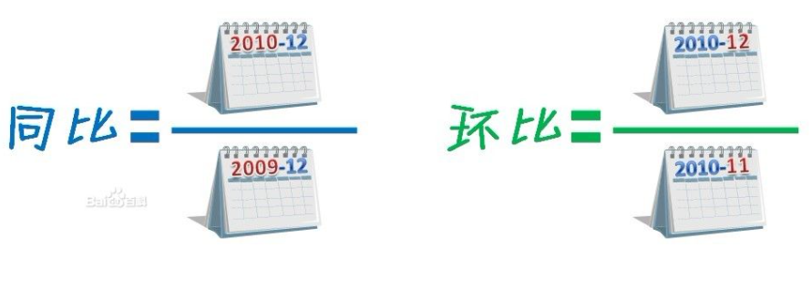
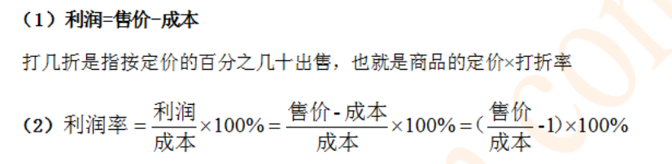
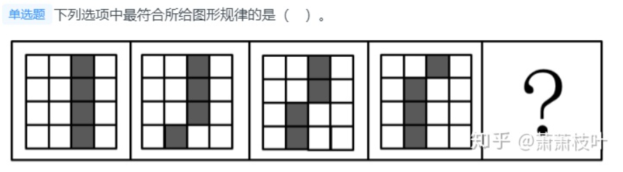
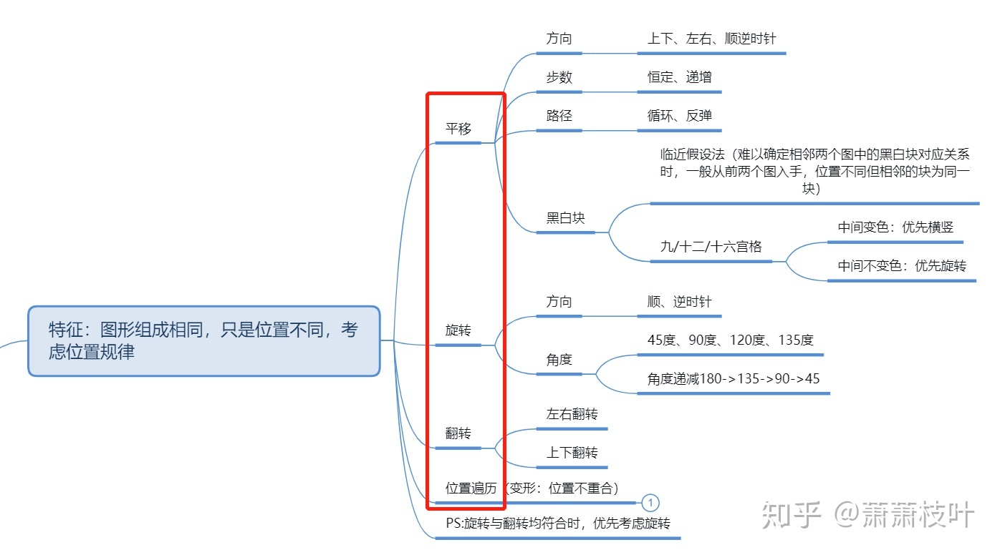
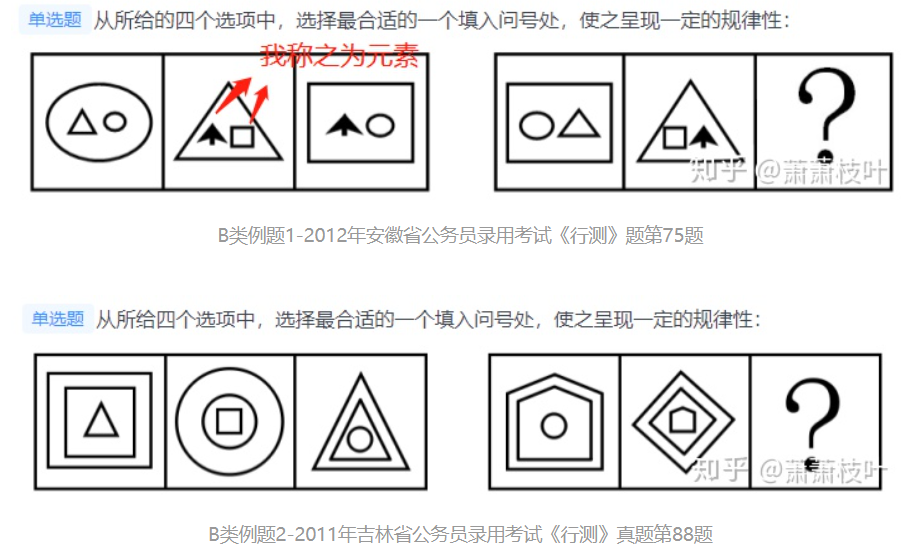
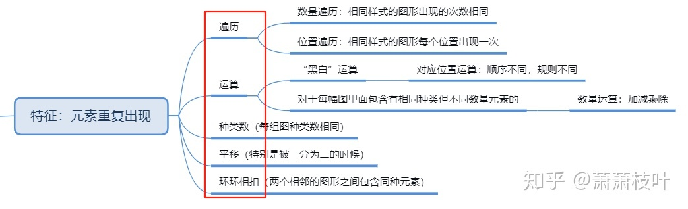
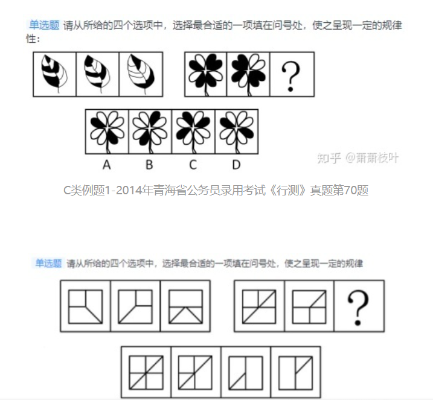
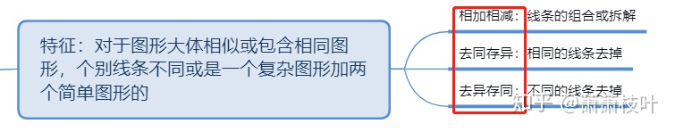
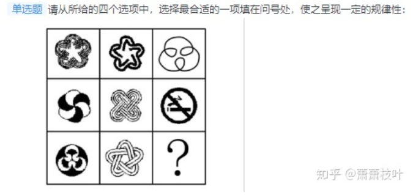

### 同比 环比

### 利润率

---

### 图形推理

#### A类： 前后图形组成相同，只是位置不同

- **平移**
- **旋转**
- **翻转**
- **位置遍历**

---

#### **B类：前后图形中元素重复出现**

- 遍历
- 运算
- 种类数
- 平移
- 环环相扣

---

#### **C类：前后图形大体相似或包含相同图形，个别线条不同或是一个复杂图形加两个简单图形的**

- **相加相减**
- **去同存异**
- **去异存同**

---

#### **D类：既没有相同图形，也没有相似图形的**

- **属性**
- **数量**
- **特殊**

**我的建议，瞎几把选吧**