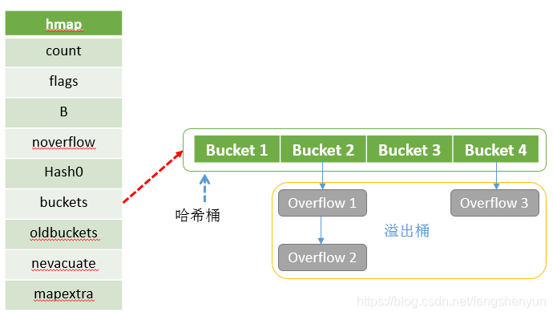
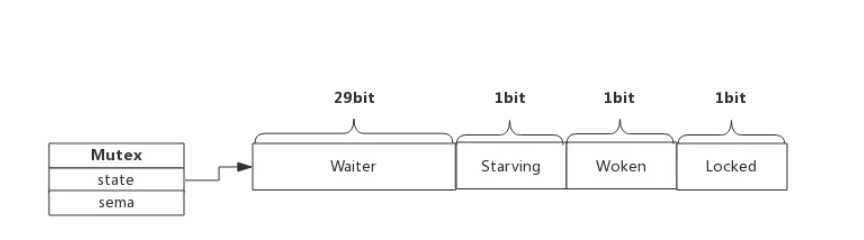
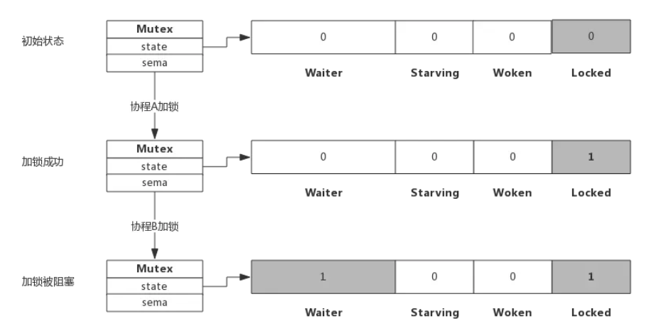
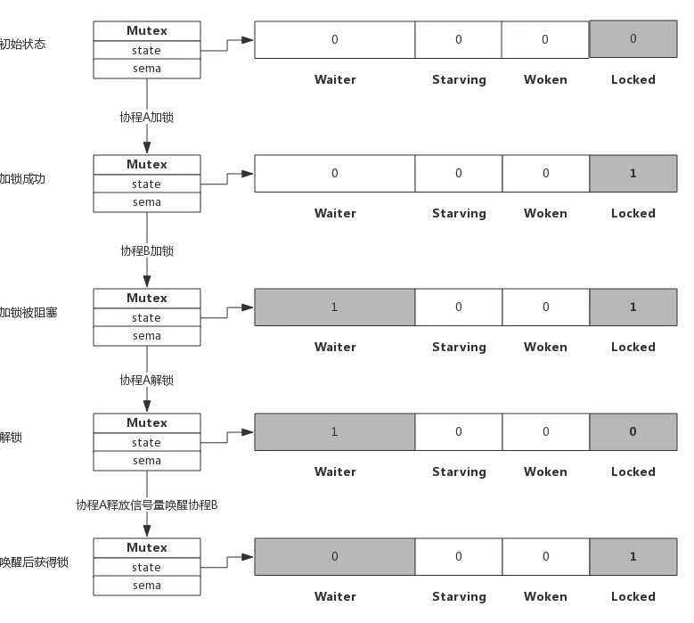
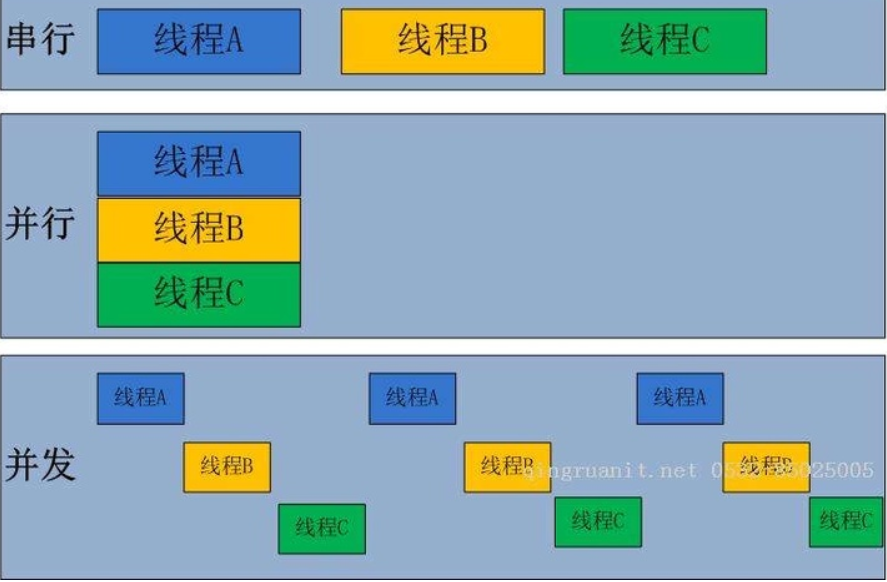

<font color='red'>go红色</font>

# Go语言

# 回答问题：是什么、为什么、怎么做 优缺点

### init函数

- ​		先于main函数执行
- ​		可用于sync.Once()	
- ​		同一个包内可以有多个init函数，不要依赖它的执行顺序
- ​		init函数不能被调用	

### channel底层 & map底层 & slice

#### channel

```go
type hchan struct {
  //channel分为无缓冲和有缓冲两种。
  //对于有缓冲的channel存储数据，借助的是如下循环数组的结构
	qcount   uint           // 循环数组中的元素数量
	dataqsiz uint           // 循环数组的长度
	buf      unsafe.Pointer // 指向底层循环数组的指针
	elemsize uint16 //能够收发元素的大小
  

	closed   uint32   //channel是否关闭的标志
	elemtype *_type //channel中的元素类型
  
  //有缓冲channel内的缓冲数组会被作为一个“环型”来使用。
  //当下标超过数组容量后会回到第一个位置，所以需要有两个字段记录当前读和写的下标位置
	sendx    uint   // 下一次发送数据的下标位置
	recvx    uint   // 下一次读取数据的下标位置
  
  //当循环数组中没有数据时，收到了接收请求，那么接收数据的变量地址将会写入读等待队列
  //当循环数组中数据已满时，收到了发送请求，那么发送数据的变量地址将写入写等待队列
	recvq    waitq  // 读等待队列
	sendq    waitq  // 写等待队列


	lock mutex //互斥锁，保证读写channel时不存在并发竞争问题
}

```

​		底层主要是通过循环数组来实现的。当G1向channel发送数据时，首先对buf加锁，然后将数据copy到buf中。sendx+1，释放锁；当G2从channel中读取数据时，也会先对buf加锁，将循环数组里的值copy到对应变量上。revcx+1，然后释放锁。

> ​		体现了GO的CSP思想，G1，G2没有共享内存来通信，而是通过通信的方式共享内存。

​		当channel缓存满了，调度器将G1的状态设置为waiting，直到有协程来读取数据，调度器再将G1设置为runable，等待执行。


有缓存 无缓存的区别：

​		无缓存必须读写都准备好；

待填坑

​		FIFO先入先出的的队列

#### map

​		map实现的底层结构是hmap，每声明一个map就有一个hmap结构体与之对应

​		向一个空map取值或取不存在值，返回空



```go
// Map contains Type fields specific to maps.
type Map struct {
    Key  *Type // Key type
    Elem *Type // Val (elem) type

    Bucket *Type // internal struct type representing a hash bucket
    Hmap   *Type // internal struct type representing the Hmap (map header object)
    Hiter  *Type // internal struct type representing hash iterator state
}
```

​		

```go
type hmap struct {
	// Note: the format of the hmap is also encoded in cmd/compile/internal/reflectdata/reflect.go.
	// Make sure this stays in sync with the compiler's definition.
	count     int // # live cells == size of map.  Must be first (used by len() builtin)
	flags     uint8
	B         uint8  // log_2 of # of buckets (can hold up to loadFactor * 2^B items)
	noverflow uint16 // approximate number of overflow buckets; see incrnoverflow for details
	hash0     uint32 // hash seed

	buckets    unsafe.Pointer // array of 2^B Buckets. may be nil if count==0.
	oldbuckets unsafe.Pointer // previous bucket array of half the size, non-nil only when growing
	nevacuate  uintptr        // progress counter for evacuation (buckets less than this have been evacuated)

	extra *mapextra // optional fields
}
```

​		map的bucket数量是  2^B个，每个bucket可以存储8个键值对。当我们向map中查找或者新增元素时，首先利用哈希算法得到一个哈希值，哈希值的低8位用于去寻找是哪个bucket，高8位是去寻找是bucket当中的哪个key。如果超出了 **8** 个的话， 那么就会溢出，此时就会再创建一个指针，链接到**额外的溢出桶**，用类似链表的方式将bucket连接起来。这时就出现了哈希冲突。我们用负载因子来衡量一个哈希表的冲突情况。

负载因子 = 键数量/bucket数量，负载因子达到6.5的时候触发扩容。

##### 引发扩容的两个场景

1. 负载因子 > 6.5时，也即平均每个bucket存储的键值对达到6.5个。

​		bucket 最大数量（2^B）**直接变成原来 bucket 数量的 2 倍**。于是，就有新老 bucket 了。注意，这时候元素都在老 bucket 里，还没迁移到新的 bucket 来。而且，新 bucket 只是最大数量变为原来最大数量（2^B）的 2 倍（2^B * 2）.

​		一次性搬迁将会造成比较大的延时，Go采用逐步搬迁策略，即每次访问map时都会触发一次搬迁，每次搬迁2个键值对。

1. overflow数量 > 2^15时，也即overflow数量超过32768时。

​		所谓等量扩容，实际上并不是扩大容量，buckets数量不变，重新做一遍类似增量扩容的搬迁动作，把松散的键值对重新排列一次，以使bucket的使用率更高，进而保证更快的存取。

#### map并发访问安全吗？

- 不安全
- 有两个解决方法：
  - 加锁
  - 使用golang自带的sync.map

#### slice

##### array 和 slice的区别

​		array指定数组的长度，slice不指定，比array多一个cap的属性

​		函数传递时，array传递的是值，slice传递的是指针，因此切片在函数内改变，在函数外也改变。


​		slice是无固定长度的数组，slice结构体除包括数组特性外，还包括cap和len属性，append的时候cap和len变化，截取切片的时候指针改变。

```go
type slice struct {
	// 一个指向底层数组的指针
	array unsafe.Pointer
	// slice当前元素个数 即len()时返回的数
	len   int
	// slice的容量 即cap()时返回的数
	cap   int
}
```

### 空结构体struct{}

- 1 channel信号
- 2 和map配合做集合
- 3 做只有方法的结构体


=======
### struct

#### struct是否可以比较

​		同一struct的两个实例，如果其中不包含不可比较部分（map，slice，function），可以比较；也可以比较两指针

​		不同struct的两个实例，强转换后可以比较

### mutex

```go
type Mutex struct {
	state int32	// 互斥锁的状态
	sema  uint32 // 信号量，协程阻塞时等待该信号量。解锁的协程释放信号量从而唤醒等待信号量的协程
}
```



无锁状态时直接加锁，locked置1，有锁时waiter加1



解锁时，如果waiter大于0，释放信号量，locked重新置1



#### 自旋过程

​		加锁时如果locked已经为1了，说明其他协程持有，不会先阻塞，而是先持续探测一段时间locked是否变0，这一过程称作自旋。

​		自旋时间很短，如果自旋过程中发现锁被释放，自旋的协程立即获得锁，即便有其他协程被唤醒也无法获取锁，自旋目的是为了避免协程的切换。

### starving

​		为了避免不停的有协程自旋插队获得锁，导致协程长时间无法获取锁，即Mutex的Starving状态。这个状态下不会自旋，一旦有协程释放锁，那么一定会唤醒一个协程并成功加锁。

### Woken

​		处于自旋状态的协程将woken置1，用于通知持有锁的协程不必释放信号量

##### 为什么重复解锁要panic

​		如果多次unlock（），每次都释放一个信号量，会唤醒多个协程来抢锁，会增加lock函数的复杂度，引起不必要的协程切换和协程唤醒。

### 闭包

在go语言中，函数被看作为第一类值，意味着函数可以像变量一样。 **匿名函数中引用外部函数的局部变量或全局变量**是闭包

### ---------------------------

### select

​		如果有一个或多个IO操作完成，则随机选择一个分支执行

​		如果没有IO操纵完成，判断是否有default，有的话执行default，没有的话阻塞直到有一个操作完成。 

### ---------------------------

​		**go 结构体实现某个接口的所有方法即 实现了该接口**

### new和make的区别

​		new的参数要求是一个类型而不是一个值，它会申请该类型的内存空间大小，并初始化为零值，返回指向该类型空间的一个指针（返回的是指针）

​		make也用于内存分配，但它只用于引用对象slice，map，channel内存的创建，返回类型是类型本身

​		var在函数体内申明是局部变量，在函数体外申明是全局变量

#### 传值和传指针

​		golang当中所有函说的传递都是值拷贝，传指针只是拷贝了一份指针副本，也指向原对象，在函数中的改变后，函数外一样改变；传值的话，函数外就不改变了。

​		但是channel、slice、map有些特殊，他们类似于传指针，可以直接传递，不用取指针后传递指针，但是如果函数需要改变slice长度，那还要传指针。在append的过程中，go为这个slice重新分配了内存，函数内的指针确实是变了，但是外面看不到。

​		map底层是一个hmap类型的结构体，函数内外两个指针都是志向hmap，当发生扩容时，hmap当中的bucket扩容一倍，新数据存在新bucket，随着读取不断将旧bucket迁移过来，虽然hmap有了新的bucket地址，但是hmap并不变。因此不需要传指针。已经是指向bucket指针的指针了。

### ---------------------------

### Go内存模型

​		happens-before。在一个groutine中对变量进行读操作可以读到其他groutine对这个变量的写操作

在单线程中happens before所表达的顺序就是程序执行的顺序，不存在并发，读操作会读到最近一个写操作。

- 读操作中写操作之后发生或者同时发生
- 读写操作之间没有别的写操作

在多线程中

- 写操作在读操作之前发生
- 其他写操作都发生在写操作之前或读操作之后

**go利用锁机制和channel来实现这种happens-before**

### Go内存管理

​		申请内存时会根据申请分配的内存大小选择不同的处理逻辑，根据大小分为微对象（<16字节），小对象（16字节到32千字节）和大对象（大于32千字节）。go的内存管理不仅会区别对待不同大小的对象，还会将内存分为不同的级别去管理 线程缓存、中心缓存、和页堆。

​		操作系统对的内存以页为单位，而**Span是内存管理的基本单位**，一组连续的Page组成Span，GO中的每个P拥有一个mcache，它保存各种大小的Span，**小对象直接从mcache分配**；mcentral是所有线程共享的缓存，**当某个mcache的某个级别的Span被分配完时，它就会向mcentral申请同级别的Span**，而大对象直接从mheap中分配。

​		mheap是堆内存的抽象，把从操作系统申请出的内存页组织成Span并保存起来，mheap的Span不够用时会向OS申请内存。

​		Go的垃圾回收机制将无用的span释放还给OS，然后再交由mheap以继续分配。（三色标记法）


​		spans用于存放spans的指针;bitmap用于标记对象，方便垃圾回收；arena就是由一个个内存页组成。

### 程序申请内存过程

> 程序中堆区中搜索内存，如果找到合适的就分配出去
>
> 如果没有找到合适的内存区域，就调用brk等命令扩大堆区从而获得更大的内存空间
>
> 调用brk之后转入内核态，虚拟内存系统开始工作，扩大程序的堆区。但此时只是分配虚拟内存，并非物理内存。
>
> brk结束调用后返回用户态，将空闲内的内存地址地址分配出去，程序继续。
>
> 当有代码读到新分配的虚拟地址时，发生缺页中断。此时由用户态再次切换到内核态，操纵系统为其分配真正的物理内存，之后再切换会用户态，程序继续。

### ---------------------------

### Go内存逃逸

#### 什么是内存逃逸

​		golang的每一个函数都会有自己的内存区域存放自己的局部变量，返回地址等。这些内存会由编译器在栈中进行分配，每一个函数都会分配一个栈帧，在函数运行时会销毁，但如果有些变量我们想在函数结束运行时继续使用，那么就需要将这个变量在堆上分配，这种从栈逃逸到堆上的情况就是内存逃逸。

#### 内存逃逸的危害

​		如果变量都跑到堆上，他会引起频繁的垃圾回收，而垃圾回收占用比较大的开销；

#### 什么是内存逃逸分析

​		内存逃逸分析是编译器在进行编译优化时，用来决定变量应该分配在栈上还是堆上的工具。通过逃逸分析，尽量把那些不需要分配到堆上的变量分配到栈上，堆上的变量少了，会减轻分配堆内存的开销。同时也会减少gc的压力，提高程序运行速度

​		**编译器会自动选择在栈上还是在堆上分配局部变量的存储空间，编译器会根据变量是否被外部引用来决定是否逃逸**

-  **如果函数外部没有引用，则优先放到栈中；** 
-  **如果函数外部存在引用，则必定放到堆中；**

#### 为什么要区分栈和堆

​		在栈上分配的内存操作系统会为其自动释放，例如函数结束时，局部变量将不复存在；计算机在底层对栈提供支持，分配专门的寄存器存放栈的地址，压栈出栈都有专门的指令。栈的效率比较高；

​		在堆上的话一切由自己负责，库函数会使用一定的方法，在堆内存中搜索可用的空间大小，如果没有又要申请更大的内存空间，堆的效率要明显低于栈。堆与栈相比，更适合不可预知大小的内存分配，但代价是速度慢，产生内存碎片，访问堆的一个具体单元，需要两次访问内存，第一次得取得指针，第二次才是真正得数据。

#### 逃逸常见的情况

1. 如果编译时slice初始大小已知并且不大，会在栈上分配，但如果slice的大小，随着运行不断append，导致slice分配更大的内存，这时会将其分配到堆上；在初始化的时候如果大小超过64KB也会直接放到堆上。
2. 发送的指针的指针或包含指针的值到channel中，由于编译阶段无法确定其作用域，会分配到堆上。
3. 函数返回的是指向slice的指针，sliceheader 和 data都逃逸，如果返回的是slice本身，那只有data逃逸；map同理
4. 尽管能够符合分配到栈的场景，但是其大小不能够在在编译时候确定的情况，也会分配到堆上
5. 调用接口类型时，具体的实现只能在运行时确定，调用过程中变量可能会从栈逃逸到堆上。

#### 避免内存逃逸的方法

- 对于小型的数据，使用传值而不是传指针，避免内存逃逸。复制栈上变量的操作，开销远比在堆上动态分配内存的小
- 避免使用长度不固定的slice切片，在编译期无法确定切片长度，只能将切片使用堆分配。
- 减少外部引用

### ---------------------------

### Go垃圾回收（GC）

cnblogs.com/thepoy/p/14598447.html

#### 垃圾回收目标

- 无内存泄漏：垃圾回收器最基本的目标就是减少防止程序员未及时释放导致的内存泄漏，垃圾回收器会识别并清理内存中的垃圾
- 自动回收无用内存：垃圾回收器作为独立的子任务，不需要程序员显式调用即可自动清理内存垃圾
- 内存整理：如果只是简单回收无用内存，那么堆上的内存空间会存在较多碎片而无法满足分配较大对象的需求，因此垃圾回收器需要重整内存空间，提高内存利用率

#### 垃圾回收常见方法

​		根据判断对象是否存活的方法，可以简单将`GC`算法分为**“引用计数式”**垃圾回收和“**追踪回收式”**垃圾回收。前者根据每个对象的引用计数器是否为`0`来判断该对象是否为未引用的垃圾对象，后者先判断哪些对象存活，然后将其余的所有对象作为垃圾进行回收。追踪回收本身包括**标记-清除**`Mark-Sweep`、标记-复制`Mark-Copy`和**标记-整理**`Mark-Compact`三种回收算法

##### 引用计数

​		引用计数`Reference counting`会为每个对象维护一个计数器，当该对象被其他对象引用时加一，引用失效时减一，当引用次数归零后即可回收对象。

**优点**：

- 原理和实现都比较简单
- 回收的即时性：当对象的引用计数为`0`时立即回收，不像其他`GC`机制需要等待特定时机再回收，提高了内存的利用率
- 不需要暂停应用即可完成回收

**缺点**：

- **无法解决循环引用的回收问题**：当`ObjA`引用了`ObjB`，`ObjB`也引用`ObjA`时，这两个对象的引用次数使用大于`0`，从而占用的内存无法被回收
- **时间和空间成本较高**：一方面是因为每个对象需要额外的空间存储引用计数器变量，另一方面是在栈上的赋值时修改引用次数时间成本较高（原本只需要修改寄存器中的值，现在计数器需要不断更新因此不是只读的，需要额外的原子操作来保证线程安全）
- **引用计数是一种摊销算法**，会将内存的回收分摊到整个程序的运行过程，但是当销毁一个很大的树形结构时无法保证响应时间

##### 追踪回收

**可达性分析算法**：第一步都是通过可达性分析算法标记`Mark`对象是否“可达”。

**优点**：

- 解决了循环引用对象的回收问题
- 占用空间更少

**缺点**：

- 同引用计数相比无法立刻识别出垃圾对象，需要依赖`GC`线程
- 算法在标记时必须暂停整个程序，即`Stop The World, STW`，否则其他线程的代码会修改对象状态从而回收不该回收的对象

##### 三色标记法

​		**白色对象**（可能死亡）：未被回收器访问到的对象。在回收开始阶段，所有对象均为白色，当回收结束后，白色对象均不可达。 

​		**灰色对象**（[波面](https://www.zhihu.com/search?q=波面&search_source=Entity&hybrid_search_source=Entity&hybrid_search_extra={"sourceType"%3A"article"%2C"sourceId"%3A"385650396"})）：已被回收器访问到的对象，但回收器需要对其中的一个或多个指针进行扫描，因为他们可能还指向白色对象。 

​		**黑色对象**（确定存活）：已被回收器访问到的对象，其中所有字段都已被扫描，黑色对象中任何一个指针都不可能直接指向白色对象。

**标记过程：**

1. 起初所有的对象都是白色的； 
2. 从根对象出发扫描所有可达对象，标记为灰色，放入待处理队列； 
3. 从待处理队列中取出灰色对象，将其引用的对象标记为灰色并放入待处理队列中，自身标记为黑色； 
4. 重复步骤3，直到待处理队列为空，此时白色对象即为不可达的“垃圾”，回收白色对象； 

根对象在垃圾回收的术语中又叫做根集合，它是垃圾回收器在标记过程时最先检查的对象。

https://zhuanlan.zhihu.com/p/334999060

> 屏障技术是不在栈上应用的，因为要保证栈的运行效率。

​		但是普通的三色标记法不能实现并发，仍需STW，在标记过程中，如增加了对某一对象的引用，该对象可能不会被标记存在，从而被错误的回收。要想实现并发的标记，则需借助屏障技术实现强三色不变性或弱三色不变性。

> - 强三色不变性 — 黑色对象不会指向白色对象，只会指向灰色对象或者黑色对象；
> - 弱三色不变性 — 黑色对象指向的白色对象必须包含一条从灰色对象经由多个白色对象的可达路径

​		插入写屏障，相对保守的屏障技术，将有可能存活的对象都标记为灰色以满足强三色不变性。插入写屏障机制只发生在堆上，而不发生在栈上，因此标记阶段完成重新对栈上的对象进行扫描，在GC准备清理白色垃圾前，会对栈上进行STW保护，重新扫描一次栈空间，删除白色垃圾对象，相比于最简单的三色标记法，插入写机制可以极大减少STW的时间。10-100ms之间

​		删除写屏障，对象被删除时触发的机制。如果灰色对象引用的白色对象被删除时，那么白色对象会被标记为灰色。回收的精度较低，可以活过这一轮GC，在下一轮GC被回收。STW 扫描整个栈（注意了，是所有的 goroutine 栈）。

在 Golang（1.8版本之后）里，用的是一种新的机制，称之为「混合写屏障」机制。它的思路总结下来就是4句话：

**1、GC开始将栈上的对象全部扫描并标记为黑色(之后不再进行第二次重复扫描，无需STW)，**

**2、GC期间，任何在栈上创建的新对象，均为黑色。**

**3、被删除的对象标记为灰色。**

**4、被添加的对象标记为灰色。**

​		混合写屏障主要的优势在于，避免了像插入写屏障那样最后STW扫描整个栈，也避免了像删除写屏障那样开始时扫描所有的栈。而是每个栈单独暂停。但回收的精度和删除写屏障一样，都相对较低。

### ---------------------------

### Go 协程池

​		使用协程池将让多余的请求进入排队状态，等待池中有空闲协程的时候来处理，这是模拟的**I/O多路复用**机制，这样就可以通过控制协程池的大小，来控制内存的消耗，让其在极端状态下，也尽可能的保证服务的**可用性。**

### ---------------------------

### 小点

- slice map function  不可比较，结构体内包含不可比较的部分就不可以比较
- 如何优雅的让所有子协程执行完后再执行主协程: 1channel 实现同步;2 sync.WaitGroup Add();Done();Wait()
- Map顺序输出，遍历key放入slice,按slice索引再输出一次
- 如何选择结构体还是结构体指针
  1. 在使用上的考虑：方法是否需要修改接收器？如果需要，接收器必须是一个指针。
  2. 在效率上的考虑：如果接收器很大，比如：一个大的结构体，使用指针接收器会好很多。
  3. 在一致性上的考虑：如果类型的某些方法必须有指针接收器，那么其余的方法也应该有指针接收器，所以无论类型如何使用，方法集都是一致的

- 深拷贝的方法：
  1. slice  Copy方法
  2. gob序列化成字节序列再反序列化生成克隆对象
  3. 先转换成json字节序列，再解析字节序列生成克隆对象
  4. 定制化拷贝 （2.3两种方法用到了reflact，速度较慢）

- channel +wait.group 可以实现简单的并发

- panic 

  ​        将 panic 控制在包边界内。**不让 panic 在包的公用接口中出现**。在每个对包外公开的函数和方法都应该 recover 到内部的 panic 并且将这些 panic 转换为错误信息，这使得 panic 非常的友好，即使高可用的服务器在这种情况下可能还在外部使用了 recover 来防止内部 panic 造成程序终止。

- gochannel实现排序： 新建一个channel，将两个channel里的数据按大小排序塞到新channel

  ```go
  func main() {
  	ch1 := create([]int{1, 3, 6})//待排序的管道1
  	ch2 := create([]int{2, 5, 9})//待排序的管道2
  	ch := merge(ch1, ch2)
  	for c := range ch {
  		fmt.Println(c)
  	}
  	for {
  		runtime.GC()
  	}
   
  }
  func create(arr []int) chan int {
  	out := make(chan int)
  	go func() {
  		for _, v := range arr {
  			out <- v
  		}
  		close(out)
  	}()
   
  	return out
  }
  func merge(ch1, ch2 chan int) chan int {
  	ch := make(chan int)
  	go func() {
  		v1, ok1 := <-ch1
  		v2, ok2 := <-ch2
  		for {
  			if ok1 || ok2 {
  				if ok1 && ok2 {
  					if v1 < v2 {
  						ch <- v1
  						v1, ok1 = <-ch1
  					} else {
  						ch <- v2
  						v2, ok2 = <-ch2
  					}
   
  				} else if ok1 && !ok2 {
  					ch <- v1
  					v1, ok1 = <-ch1
  				} else {
  					ch <- v2
  					v2, ok2 = <-ch2
  				}
  			} else {
  				close(ch)
  				break
  			}
  		}
  	}()
   
  	return ch
  }
  ```

  

### ---------------------------

### runtime包里面的方法 

#### Gosched

暂停当前goroutine，使其他goroutine先行运算。只是暂停，不是挂起，当时间片轮转到该协程时，Gosched()后面的操作将自动恢复

#### Goexit

立即终止当前协程，不会影响其它协程，且终止前会调用此协程声明的defer方法。由于Goexit不是panic，所以recover捕获的error会为nil

```go
package main

import (
    "fmt"
    "runtime"
    "time"
)

func main() {
    go func(){
        defer func(){
            fmt.Println("defer func executed!")
            fmt.Println("recovered error == ",recover())
        }()

        for i:=0;i<3;i++{
            if i==1{
                runtime.Goexit()
            }

            fmt.Println(i)
        }
    }()

    time.Sleep(2*time.Second)
}
```


#### GOMAXPROCS

设置可同时执行的逻辑Cpu数量，默认和硬件的线程数一致而不是核心数，可以通过调用GOMAXPROCS(-1)来获取当前逻辑Cpu数

### --------------------------

### go的profile工具

https://geektutu.com/post/hpg-pprof.html

#### 1.1 CPU 性能分析

​		CPU 性能分析(CPU profiling) 是最常见的性能分析类型。

​		启动 CPU 分析时，运行时(runtime) **将每隔 10ms 中断一次**，记录此时正在运行的协程(goroutines) 的堆栈信息。

​		程序运行结束后，可以分析记录的数据找到最热代码路径(hottest code paths)。

#### 1.2 内存性能分析

​		内存性能分析(Memory profiling) 记录堆内存分配时的堆栈信息，忽略栈内存分配信息。

​		内存性能分析启用时，默认每1000次采样1次，这个比例是可以调整的。因为内存性能分析是基于采样的，因此基于内存分析数据来判断程序所有的内存使用情况是很困难的。

#### 1.3 阻塞性能分析

​		阻塞性能分析(block profiling) 是 Go 特有的。

​		阻塞性能分析用来记录一个协程等待一个共享资源花费的时间。在判断程序的并发瓶颈时会很有用。阻塞的场景包括：

- 在没有缓冲区的信道上发送或接收数据。
- 从空的信道上接收数据，或发送数据到满的信道上。
- 尝试获得一个已经被其他协程锁住的排它锁。

一般情况下，当所有的 CPU 和内存瓶颈解决后，才会考虑这一类分析。

#### 1.4 锁性能分析

​		锁性能分析(mutex profiling) 与阻塞分析类似，但专注于因为锁竞争导致的等待或延时。

### --------------------------

### 栈和堆（程序内存分区）

栈由操作系统自动分配释放 ，用于存放函数的参数值、局部变量等

堆由开发人员分配和释放， 若开发人员不释放，程序结束时由 OS 回收，分配方式类似于链表

Go语言区别于C/C++，虽然变量申请在堆空间上，但是它有自动回收垃圾的功能，所以这些堆地址空间也无需我们手动回收，系统会在需要释放的时刻自动进行垃圾回收。

### --------------------------

### gmp具体的调度策略

### GO并发模型的实现原理

​		到了操作系统层面，一定是以线程的形态存在的。而操作系统根据资源访问权限的不同，体系架构可分为用户空间和内核空间；内核空间主要操作访问CPU资源、I/O资源、内存资源等硬件资源，为上层应用程序提供最基本的基础资源，用户空间呢就是上层应用程序的固定活动空间，用户空间不可以直接访问资源，必须通过“系统调用”、“库函数”或“Shell脚本”来调用内核空间提供的资源。

- **用户级线程模型**


- **内核级线程模型**


- **两级线程模型**（GMP）


#### 多进程 / 线程时代有了调度器需求

​		**CPU对待进程和线程的态度是一样的**，进程拥有太多的资源，进程的创建、切换、销毁，都会占用很长的时间，CPU 虽然利用起来了，但如果进程过多，CPU 有很大的一部分都被用来进行进程调度了。

- 高内存占用
- 调度高消耗的CPU


​		一个线程分为 “内核态 “线程和” 用户态 “线程，内核线程依然叫 “线程 (thread)”，用户线程叫 “协程 (co-routine)”.

多个协程 (co-routine) 绑定**一个或者多个**线程 (thread) 上呢


#### N:1关系

​		N 个协程绑定 1 个线程，优点就是协程在用户态线程即完成切换，不会陷入到内核态，这种切换非常的轻量快速。但也有很大的缺点，1 个进程的所有协程都绑定在 1 个线程上


缺点：

- 某个程序用不了硬件的多核加速能力
- 一旦某协程阻塞，造成线程阻塞，本进程的其他协程都无法执行了，根本就没有并发的能力了。

#### 1:1 关系

​		1 个协程绑定 1 个线程，这种最容易实现。协程的调度都由 CPU 完成了，不存在 N:1 缺点，


缺点：

- 协程的创建、删除和切换的代价都由 CPU 完成，有点略显昂贵了。

#### M:N 关系

​		M 个协程绑定 1 个线程，是 N:1 和 1:1 类型的结合，克服了以上 2 种模型的缺点，但实现起来最为复杂。


​		协程跟线程是有区别的，线程由 CPU 调度是抢占式的，***协程由用户态调度是协作式的，一个协程让出 CPU 后，才执行下一个协程**。*

### Go 语言的协程 goroutine

​		Go 为了提供更容易使用的并发方法，使用了 goroutine 和 channel。goroutine 来自协程的概念，让一组可复用的函数运行在一组线程之上，**即使有协程阻塞，该线程的其他协程也可以被 runtime 调度**，转移到其他可运行的线程上

Goroutine 特点：

- 占用内存更小（2KB左右，系统线程需要1-8MB）
- 调度更灵活（runtime 调度）

####  GMP 模型

GMP是一种协程调度模型

- G：**Goroutine 的缩写**，每次 go func() 都代表一个 G，无限制，但受内存影响。使用 struct runtime.g，包含了当前 goroutine 的状态、堆栈、上下文
- M：**工作线程(OS thread)也被称为 Machine**，使用 struct runtime.m，所有 M 是有线程栈的。M 的默认数量限制是 10000（来源），可以通过debug.SetMaxThreads修改。
- P：**Processor，是一个抽象的概念，**并不是真正的物理 CPU，**P 表示执行 Go 代码所需的资源**，可以通过 GOMAXPROCS 进行修改。`当 M 执行 Go 代码时，会先关联 P`。当 M 空闲或者处在系统调用时，就需要 P。且在 Go1.5 之后GOMAXPROCS 被默认设置可用的核数，而之前则默认为1


- 全局队列（Global Queue）：存放等待运行的 G。
- P 的本地队列：同全局队列类似，存放的也是等待运行的 G，存的数量有限，不超过 **256** 个。新建 G’时，G’优先加入到 P 的本地队列，如果队列满了，则会把本地队列中一半的 G 移动到全局队列。
- P 列表：所有的 P 都在程序启动时创建，并保存在数组中，最多有 **GOMAXPROCS(可配置)** 个。
- M：**线程想运行任务就得获取 P，从 P 的本地队列获取 G**，P 队列为空时，M 也会尝试从全局队列拿一批 G 放到 P 的本地队列，或从其他 P 的本地队列偷一半放到自己 P 的本地队列。M 运行 G，G 执行之后，M 会从 P 获取下一个 G，不断重复下去。

#### 调度器的设计策略

​		复用线程：避免频繁的创建、销毁线程，而是对线程的复用。

1）**work stealing 机制**

​		 当本线程无可运行的 G 时，尝试从其他线程绑定的 P 偷取 G，而不是销毁线程。

2）**hand off 机制**

​		当本线程因为 G 进行系统调用阻塞时，线程释放绑定的 P，把 P 转移给其他空闲的线程执行。

- 利用并行：GOMAXPROCS 设置 P 的数量，最多有 GOMAXPROCS 个线程分布在多个 CPU 上同时运行。GOMAXPROCS 也限制了并发的程度，比如 GOMAXPROCS = 核数/2，则最多利用了一半的 CPU 核进行并行。
- 抢占：在 coroutine 中要等待一个协程主动让出 CPU 才执行下一个协程，在 Go 中，一个 goroutine 最多占用 CPU 10ms，防止其他 goroutine 被饿死，这就是 goroutine 不同于 coroutine 的一个地方。

全局 G 队列：在新的调度器中依然有全局 G 队列，但功能已经被弱化了，当 M 执行 work stealing 从其他 P 偷不到 G 时，它可以从全局 G 队列获取 G


可视化GMP调度还没看 https://blog.csdn.net/xmcy001122/article/details/119392934

#### G

```go
/// runtime/runtime2.go 关键字段
type g struct {
    stack       stack   // g自己的栈

    m            *m      // 执行当前g的m
    sched        gobuf   // 保存了g的现场，goroutine切换时通过它来恢复
    atomicstatus uint32  // g的状态Gidle,Grunnable,Grunning,Gsyscall,Gwaiting,Gdead
    goid         int64
    schedlink    guintptr // 下一个g, g链表

    preempt       bool //抢占标记

    lockedm        muintptr // 锁定的M,g中断恢复指定M执行
    gopc           uintptr  // 创建该goroutine的指令地址
    startpc        uintptr  // goroutine 函数的指令地址
}
```

#### M

```go
/// runtime/runtime2.go 关键字段
type m struct {
    g0      *g     // g0, 每个M都有自己独有的g0

    curg          *g       // 当前正在运行的g
    p             puintptr // 当前用于的p
    nextp         puintptr // 当m被唤醒时，首先拥有这个p
    id            int64
    spinning      bool // 是否处于自旋

    park          note
    alllink       *m // on allm
    schedlink     muintptr // 下一个m, m链表
    mcache        *mcache  // 内存分配
    lockedg       guintptr // 和 G 的lockedm对应
    freelink      *m // on sched.freem

}
```

#### P

```go
/// runtime/runtime2.go 关键字段
type p struct {
    id          int32
    status      uint32 // 状态
    link        puintptr // 下一个P, P链表
    m           muintptr // 拥有这个P的M
    mcache      *mcache  

    // P本地runnable状态的G队列
    runqhead uint32
    runqtail uint32
    runq     [256]guintptr
    
    runnext guintptr // 一个比runq优先级更高的runnable G

    // 状态为dead的G链表，在获取G时会从这里面获取
    gFree struct {
        gList
        n int32
    }

    gcBgMarkWorker       guintptr // (atomic)
    gcw gcWork

}
```


### ---------------------------

### goroutine创建数量

 受内存影响，2K左右一个，但不能无限多

#### 利用 channel 的缓存区

​		缓存区满，则阻塞

```go
// main_chan.go
func main() {
	var wg sync.WaitGroup
	ch := make(chan struct{}, 3)
	for i := 0; i < 10; i++ {
		ch <- struct{}{}
		wg.Add(1)
		go func(i int) {
			defer wg.Done()
			log.Println(i)
			time.Sleep(time.Second)
			<-ch
		}(i)
	}
	wg.Wait()
}
```

#### 利用第三方库

​		协程池

​		通过控制协程池的大小，来控制内存的消耗，让其在极端状态下，也尽可能的保证服务的**可用性。**

#### 调整系统资源的上限

### ---------------------------

### 进程、协程与线程的区别

概念
　　**进程**

​		进程是具有一定独立功能的程序关于某个数据集合上的一次运行活动,进程是系统进行资源分配和调度的一个独立单位。每个进程都有自己的独立内存空间，不同进程通过进程间通信来通信。由于进程比较重量，占据独立的内存，所以上下文进程间的切换开销（栈、寄存器、虚拟内存、文件句柄等）比较大，但相对比较稳定安全。

​		进程通信（IPC）有

​		 管道：类似于channel

​		消息队列：消息队列

​		共享内存：我们都知道，系统加载一个进程的时候，分配给进程的内存并不是实际物理内存，而是[虚拟内存空间](https://www.zhihu.com/search?q=虚拟内存空间&search_source=Entity&hybrid_search_source=Entity&hybrid_search_extra={"sourceType"%3A"article"%2C"sourceId"%3A"104713463"})。那么我们可以让两个进程各自拿出一块虚拟地址空间来，然后**映射到相同的物理内存**中，这样，两个进程虽然有着独立的虚拟内存空间，但有一部分却是映射到相同的[物理内存](https://www.zhihu.com/search?q=物理内存&search_source=Entity&hybrid_search_source=Entity&hybrid_search_extra={"sourceType"%3A"article"%2C"sourceId"%3A"104713463"})，这就完成了内存共享机制了。

​		信号量：解决线程安全的问题，实现进程间的互斥和同步

​		Socket：网络通信，主机内不同进程、与其他主机通信

　　**线程**

​		线程是指进程内的一个执行单元,也是进程内的可调度实体。线程是进程的一个实体,是CPU调度和分派的基本单位,它是比进程更小的能独立运行的基本单位。线程自己基本上不拥有系统资源,只拥有一点在运行中必不可少的资源(如程序计数器,一组寄存器和栈)，但是它可与同属一个进程的其他的线程共享进程所拥有的全部资源。**线程间通信主要通过共享内存**，上下文切换很快，资源开销较少，但相比进程不够稳定容易丢失数据。

​		线程之间的同步与互斥主要通过锁机制来实现，包括互斥锁、读写锁、自旋锁、条件锁、信号量等等

　　**协程**

​		协程是非抢占式（相对于线程的抢占），但是以抢占式调度的逻辑，防止一个协程死循环，其他饿死

​		协程是一种用户态的轻量级线程，协程的调度完全由用户控制。从技术的角度来说，“协程就是你可以暂停执行的函数”。协程拥有自己的寄存器上下文和栈。协程调度切换时，将寄存器上下文和栈保存到其他地方，在切回来的时候，恢复先前保存的寄存器上下文和栈，直接操作栈则基本没有内核切换的开销，可以不加锁的访问全局变量，所以上下文的切换非常快。

**CPU密集型代码(各种循环处理、计算等等)：使用多进程。IO密集型代码(文件处理、网络爬虫等)：使用多线程**

​		IO密集型，大部分时间在处理I/O请求，不需要CPU提供多大算力，这是后频繁切换可以提高并发性，所以I/O密集型的处理，希望在高并发下进行，[多线程](https://www.zhihu.com/search?q=多线程&search_source=Entity&hybrid_search_source=Entity&hybrid_search_extra={"sourceType"%3A"answer"%2C"sourceId"%3A"1415106615"})并发消耗资源少。

​		CPU密集型，占用CPU算力大，希望能获得更长的时间轮片而不是经常切换；这样使用进程较好，进程本身优于线程，只是切换调度消耗的资源多。

#### **线程与进程的区别:**

1) 地址空间:线程是进程内的一个执行单元，进程内至少有一个线程，它们共享进程的地址空间，而进程有自己独立的地址空间
2) 资源拥有:进程是资源分配和拥有的单位,同一个进程内的线程共享进程的资源
3) 线程是处理器调度的基本单位,但进程不是
4) 二者均可并发执行

5) 每个独立的线程有一个程序运行的入口、顺序执行序列和程序的出口，**但是线程不能够独立执行**，必须依存在应用程序中，由应用程序提供多个线程执行控制

#### **协程与线程的区别:**

​		**线程在多核的环境下是能做到真正意义上的并行执行的** ，**而协程是为并发而生的，在高并发的场景下，很多时间都在等待IO操作完成，如果能在同一线程内开多个协程处理一些IO操作，会大大减小原本创建线程的开销**。

​		线程是抢占式的，协程是非抢占式的，但有抢占式调度的逻辑，防止一个协程死循环。

​		协程不是取代线程，而是抽象在线程之上，线程是被分割的CPU资源，协程需要线程来承载运行，通过GMP调度最大程度的利用线程，提高并发能力。

#### 协程为什么开销小

线程由内核态调度，将寄存器信息保存到内存，再恢复另一个线程的状态；协程有GMP调度器，不需要切换到内核态

从栈空间上来看，线程有一个固定的栈大小（几MB），协程的话初始只有2KB，约1000倍的差距。



### ---------------------------

### slice和map并发不安全及解决方法

​		切片并发不安全，会丢失数据；解决办法：加锁

​		map并发不安全，会报错；解决办法，手动加锁或者sync.Map（丢失部分性能）

### ---------------------------

### Go 语言实现 RPC 调用

#### gRPC

​		是谷歌开发的一个远程过程调用系统，它支持多种语言，默认使用protobuf进行对象化序列压缩。

​		1.gRPC通信的第一步是定义IDL，即我们的接口文档（后缀为.proto） **定义接口**

​		2.第二步是编译proto文件，得到存根（stub）文件，即上图深绿色部分。 **编译得到存根文件**

​		3.第三步是服务端（gRPC Server）实现第一步定义的接口并启动，这些接口的定义在存根文件里面	**实现接口并启动**

​		4.最后一步是客户端借助存根文件调用服务端的函数，虽然客户端调用的函数是由服务端实现的，但是调用起来就像是**本地函数**一样。 **客户端远程调用**

​		默认**使用HTTP2协议**，二进制传输。

#### 调用流程

​		**客户端存根，存放服务端的地址消息，再将客户端的请求参数打包成网络消息，然后通过网络远程发送给服务方。
​		服务端存根，接收客户端发送过来的消息，将消息解包，并调用本地的方法。**


1. 客户端调用客户端stub（client stub）。这个调用是在本地，并将调用参数push到栈（stack）中。
2. 客户端stub（client stub）将这些参数包装，并通过系统调用发送到服务端机器。打包的过程叫 marshalling。（常见方式：XML、JSON、二进制编码）
3. 客户端本地操作系统发送信息至服务器。（可通过自**定义TCP协议或HTTP传输**）
4. 服务器系统将信息传送至服务端stub（server stub）。
5. 服务端stub（server stub）解析信息。该过程叫 unmarshalling。
6. 服务端stub（server stub）调用程序，并通过类似的方式返回给客户端。


#### RPC 与 HTTP 区别

RPC 调用实现的方式是和 HTTP 有异曲同工之处的，但是对于 RPC 与 HTTP 在 请求 / 响应中还是存在着差别的：


1. HTTP 与 RPC 协议在实现上是不同的，大家都了解到 HTTP 原理就是 客户端请求服务端，服务端去响应并返回结果，但是 RPC 协议设计的时候采用的方式就**是服务端给客户端提供 TCP 长连接服务**，Client 端去调用 Server 提供的接口，实现特定的功能；
1. RPC传输效率高，性能消耗低，适合对内的调用；HTTP内容更为复杂，可以api调用，浏览器调用，适合对外。
2. **RPC 可以同时提供同步调用及异步调用**，而 HTTP 提供的方式就是同步调用，客户端会等待并接受服务端的请求处理的结果；
3. RPC 服务设计可以提高代码编写过程中的解耦操作，提高代码的可移植性，每一个 服务可以设计成提供特定功能的小服务，客户端去调取远程的服务，而不用去关心远程是怎么实现的。

​		给结构体注册rpc服务，然后把rpc挂载到http服务上面，当http服务打开的时候我们就可以通过rpc客户端来调用结构体中符合rpc标准的的方法。

https://darjun.github.io/2020/05/08/godailylib/rpc/ PRC库

### ---------------------------

### time.Sleep(time.second)

https://zhuanlan.zhihu.com/p/269561870


1. **进入睡眠**
2. **恢复执行**

### ---------------------------

### 并发问题 channel or 锁

​		**channel is first class**

1. 先找到数据的流动，并且还要画出来，数据流动的路径换成channel，channel的两端设计成协程

2. 基于画出来的图设计简要的channel方案，代码需要做什么

3. 这个方案是不是有点复杂，是不是用Mutex更好一点？设计一个简要的Mutex方案，对比&选择易做的、高效的

   **对比：**

   channel是两点间的关系；mutex可以有更多进程操作

   channel体现数据流动的；mutex的能力是数据不动，某段时间给一个协程访问数据的权限

   channel可以用于分发任务

### ---------------------------

### Context包

​		在 Go http包的Server中，每一个请求在都有一个对应的 goroutine 去处理。请求处理函数通常会启动额外的 goroutine 用来访问后端服务，比如数据库和RPC服务。用来处理一个请求的 goroutine 通常需要访问一些与请求特定的数据，比如终端用户的身份认证信息、验证相关的token、请求的截止时间。 当一个请求被取消或超时时，所有用来处理该请求的 goroutine 都应该迅速退出，然后系统才能释放这些 goroutine 占用的资源。

​		context是GO1.7版本加入的一个标准库，它定义了`Context`类型，专门用来简化 对于处理单个请求的多个 goroutine 之间与请求域的数据、取消信号、截止时间等相关操作，这些操作可能涉及多个 API 调用。

对服务器传入的请求应该创建上下文，而对服务器的传出调用应该接受上下文。它们之间的函数调用链必须传递上下文，或者可以使用`WithCancel`、`WithDeadline`、`WithTimeout`或`WithValue`创建的派生上下文。当一个上下文被取消时，它派生的所有上下文也被取消。

当一个goroutine在衍生一个goroutine时，context可以跟踪到子goroutine，从而达到控制他们的目的；

#### context 重写select例子

```go
package main

import (
	"fmt"
    "time"
    "context"
)

func main() {
    ctx, cancel := context.WithCancel(context.Background())
    // 开启goroutine，传入ctx
    go func(ctx context.Context) {
        for {
            select {
            case <- ctx.Done():
                fmt.Println("任务1 结束了。。。")
                return
            default:
                fmt.Println(" 任务1 正在运行中。")
                time.Sleep(time.Second * 2)
            }
        }
    }(ctx)
    
    // 运行10s后停止
    time.Sleep(time.Second * 10)
    fmt.Println("需要停止任务1。。。")
    // 使用context的cancel函数停止goroutine
    cancel()
    // 为了检测监控过是否停止，如果没有监控输出，就表示停止了
    time.Sleep(time.Second * 3)
}

```

#### **Context控制多个goroutine**

```go
package main

import (
    "fmt"
    "time"
    "context"
)

// 使用context控制多个goroutine
func watch(ctx context.Context, name string) {
    for {
        select {
        case <- ctx.Done():
            fmt.Println(name, "退出 ，停止了。。。")
            return
        default:
            fmt.Println(name, "运行中。。。")
            time.Sleep(2 * time.Second)
        }
    }
}

func main() {
    ctx, cancel := context.WithCancel(context.Background())
    go watch(ctx, "【任务1】")
    go watch(ctx, "【任务2】")
    go watch(ctx, "【任务3】")

    time.Sleep(time.Second * 10)
    fmt.Println("通知任务停止。。。。")
    cancel()
    time.Sleep(time.Second * 5)
    fmt.Println("真的停止了。。。")
}
```

#### **context接口**

```go
type Context interface {
    Deadline() (deadline time.Time, ok bool)
    Done() <-chan struct{}
    Err() error
    Value(key interface{}) interface{}
}
```

1. `Deadline`:是获取设置的截止时间的意思，第一个返回值是截止时间，到了这个时间点，Context 会自动发起取消请求；第二个返回值 `ok==false` 时表示没有设置截止时间，如果需要取消的话，需要调用取消函数进行取消。
2. `Done`:该方法返回一个只读的 chan，类型为 struct{}，我们在 goroutine 中，如果该方法返回的 chan 可以读取，则意味着`parent context`已经发起了取消请求，我们通过 Done 方法收到这个信号后，就应该做清理操作，然后退出 goroutine，释放资源。
3. `Err` 方法返回取消的错误原因，因为什么 Context 被取消。
4. `Value`方法获取该 Context 上绑定的值，是一个键值对，所以要通过一个 Key 才可以获取对应的值，这个值一般是线程安全的。

```go
func WithCancel(parent Context) (ctx Context, cancel CancelFunc)
func WithDeadline(parent Context, deadline time.Time) (Context, CancelFunc)
func WithTimeout(parent Context, timeout time.Duration) (Context, CancelFunc)
func WithValue(parent Context, key, val interface{}) Context
```

#### **Context最佳实战**

1. 不要把 Context 放在结构体中，要以参数的方式传递
2. 以 Context 作为参数的函数方法，应该把 Context 作为第一个参数，放在第一位
3. 给一个函数方法传递 Context 的时候，不要传递 nil，如果不知道传递什么，就使用 context.TODO
4. Context 的 Value 相关方法应该传递必须的数据，不要什么数据都使用这个传递
5. Context 是线程安全的，可以放心的在多个 goroutine 中传递

### ---------------------------

### panic and recover

​		**可恢复的 panic 必须要 recover 的配合**。 而且，这个 recover 必须位于同一 goroutine 的直接调用链上,（例如，如果 A 依次调用了 B 和 C，而 B 包含了 recover，而 C 发生了 panic，则这时 B 的 panic 无法恢复 C 的 panic； 又例如 A 调用了 B 而 B 又调用了 C，那么 C 发生 panic 时，如果 A 要求了 recover 则仍然可以恢复）， 否则无法对 panic 进行恢复。


```go
func main() {
	defer func() {
		if err := recover(); err != nil {
			log.Printf("recover: %v", err)
		}
	}()
	
	panic("sim lou.")
}


2019/10/26 22:19:33 recover: sim lou.

Process finished with exit code 0
```

### ---------------------------

### 2 sync.Cond 的四个方法

sync.Cond 的定义如下：

```
// Each Cond has an associated Locker L (often a *Mutex or *RWMutex),
// which must be held when changing the condition and
// when calling the Wait method.
//
// A Cond must not be copied after first use.
type Cond struct {
        noCopy noCopy

        // L is held while observing or changing the condition
        L Locker

        notify  notifyList
        checker copyChecker
}
```

每个 Cond 实例都会关联一个锁 L（互斥锁 *Mutex，或读写锁 *RWMutex），当修改条件或者调用 Wait 方法时，必须加锁。

和 sync.Cond 相关的有如下几个方法：

#### 2.1 NewCond 创建实例

```
func NewCond(l Locker) *Cond
```

NewCond 创建 Cond 实例时，需要关联一个锁。

#### 2.2 Broadcast 广播唤醒所有

```
// Broadcast wakes all goroutines waiting on c.
//
// It is allowed but not required for the caller to hold c.L
// during the call.
func (c *Cond) Broadcast()
```

Broadcast 唤醒所有等待条件变量 c 的 goroutine，无需锁保护。

#### 2.3 Signal 唤醒一个协程4

```
// Signal wakes one goroutine waiting on c, if there is any.
//
// It is allowed but not required for the caller to hold c.L
// during the call.
func (c *Cond) Signal()
```

Signal 只唤醒任意 1 个等待条件变量 c 的 goroutine，无需锁保护。

#### 2.4 Wait 等待

```
// Wait atomically unlocks c.L and suspends execution
// of the calling goroutine. After later resuming execution,
// Wait locks c.L before returning. Unlike in other systems,
// Wait cannot return unless awoken by Broadcast or Signal.
//
// Because c.L is not locked when Wait first resumes, the caller
// typically cannot assume that the condition is true when
// Wait returns. Instead, the caller should Wait in a loop:
//
//    c.L.Lock()
//    for !condition() {
//        c.Wait()
//    }
//    ... make use of condition ...
//    c.L.Unlock()
//
func (c *Cond) Wait()
```

调用 Wait 会自动释放锁 c.L，并挂起调用者所在的 goroutine，因此当前协程会阻塞在 Wait 方法调用的地方。如果其他协程调用了 Signal 或 Broadcast 唤醒了该协程，那么 Wait 方法在结束阻塞时，会重新给 c.L 加锁，并且继续执行 Wait 后面的代码。

对条件的检查，使用了 `for !condition()` 而非 `if`，是因为当前协程被唤醒时，条件不一定符合要求，需要再次 Wait 等待下次被唤醒。为了保险起见，使用 `for` 能够确保条件符合要求后，再执行后续的代码。

```
c.L.Lock()
for !condition() {
    c.Wait()
}
... make use of condition ...
c.L.Unlock()
```

### 3 使用示例

接下来我们实现一个简单的例子，三个协程调用 `Wait()` 等待，另一个协程调用 `Broadcast()` 唤醒所有等待的协程。

```
var done = false

func read(name string, c *sync.Cond) {
	c.L.Lock()
	for !done {
		c.Wait()
	}
	log.Println(name, "starts reading")
	c.L.Unlock()
}

func write(name string, c *sync.Cond) {
	log.Println(name, "starts writing")
	time.Sleep(time.Second)
	c.L.Lock()
	done = true
	c.L.Unlock()
	log.Println(name, "wakes all")
	c.Broadcast()
}

func main() {
	cond := sync.NewCond(&sync.Mutex{})

	go read("reader1", cond)
	go read("reader2", cond)
	go read("reader3", cond)
	write("writer", cond)

	time.Sleep(time.Second * 3)
}
```

- `done` 即互斥锁需要保护的条件变量。
- `read()` 调用 `Wait()` 等待通知，直到 done 为 true。
- `write()` 接收数据，接收完成后，将 done 置为 true，调用 `Broadcast()` 通知所有等待的协程。
- `write()` 中的暂停了 1s，一方面是模拟耗时，另一方面是确保前面的 3 个 read 协程都执行到 `Wait()`，处于等待状态。main 函数最后暂停了 3s，确保所有操作执行完毕。

运行结果如下：

```
$ go run main.go
2021/01/14 23:18:20 writer starts writing
2021/01/14 23:18:21 writer wakes all
2021/01/14 23:18:21 reader2 starts reading
2021/01/14 23:18:21 reader3 starts reading
2021/01/14 23:18:21 reader1 starts reading
```

### go内存泄漏

runtime/pprof

### ---------------------------

### return 和 defer

- 多个defer类似于栈，先进后出
- 有多个return时，只有defer被return包裹才能执行defer
- return变量操作时，并不是原子操作，分为赋值+返回

```go
func test3() int {
	var i int
	defer i++
	return i
}

// 结果为0

func test4() (i int) {
	defer i++
	return i
}

// 结果为1

```


### go的异常处理

### ---------------------------

### Protobuf（Protocol Buffers）

​		是一种二进制通信格式，相比于json这种文本型不同，二进制更加的快速，并且能够直接生成多种语言的解析和客户端代码，但无法阅读。

