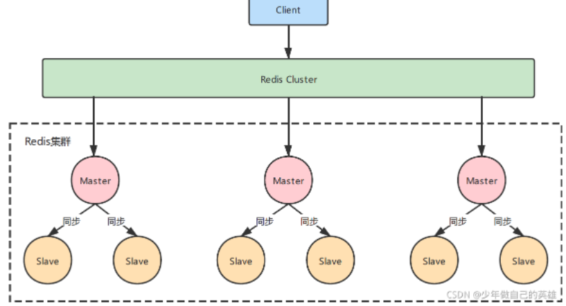
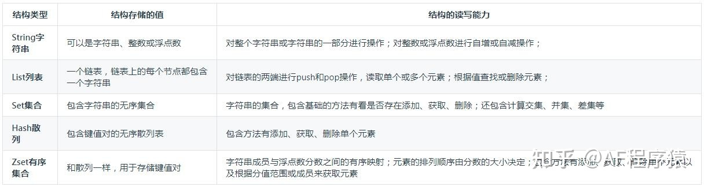
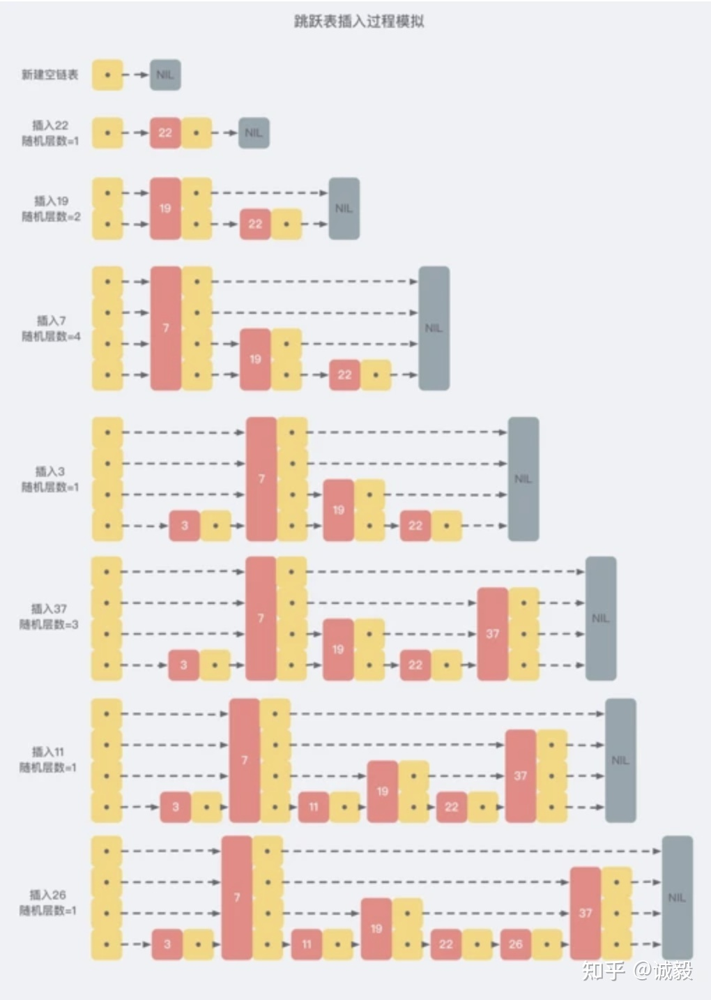
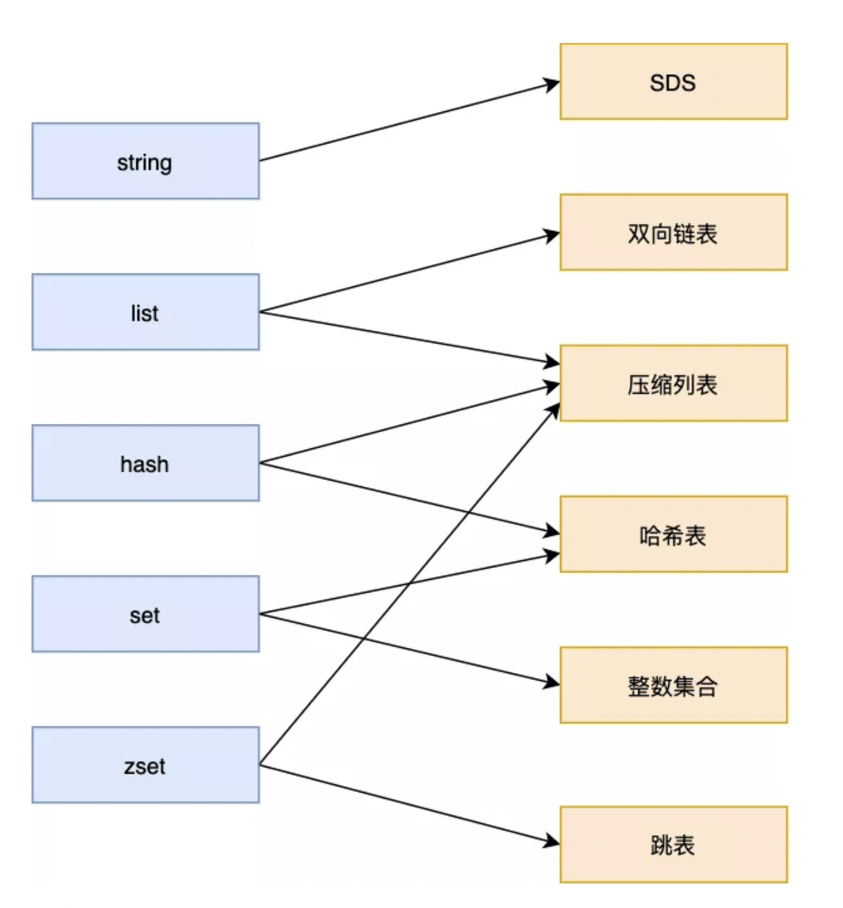
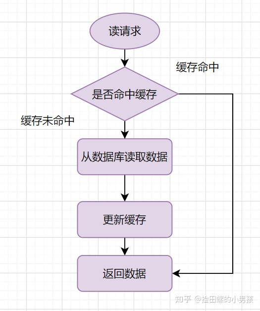
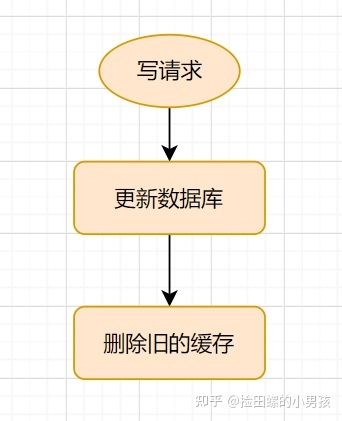
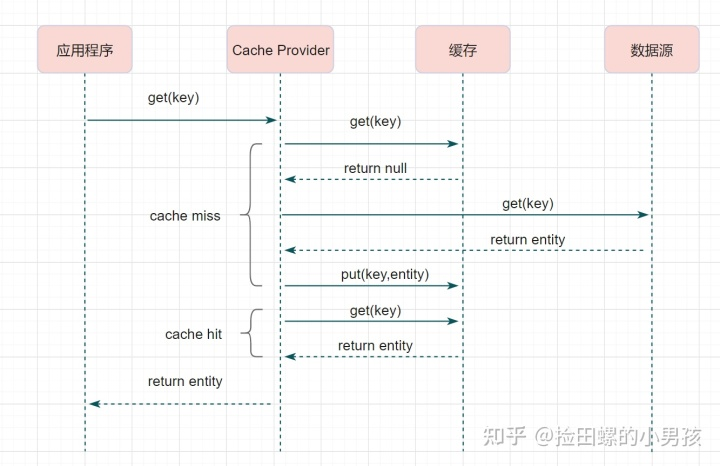
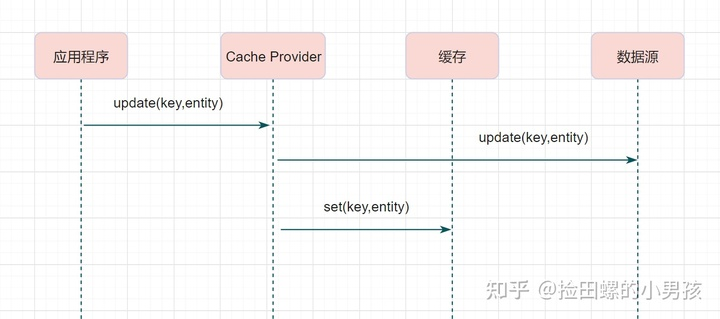
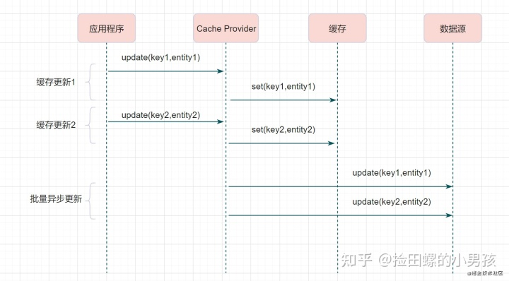

# redis

### 为什么使用redis

**主要有两方面**：

​		**一方面是提高查询性能**：在碰到需要查询执行时间久、而数据又不频繁修改的数据时，适合将数据放入像redis这样的内存数据库，这样后面的数据直接从缓存中读取，提高查询的性能

​		**另一方面是为了提高并发**，在大并发的情况下，所有请求直接请求数据库，可能会导致数据库异常，redis接收请求的能力要高于mysql数据库，因此使用redis做一个缓存，提高查询的并发能力

### redis&memcached

​		reids支持数据的持久化，可以将内存中的数据保存到磁盘中，重启的时候可以再次加载使用，而memcached不支持持久化。

### redis应用场景

​		一方面为了提高性能：在遇到经常查询的SQL操作时，适合将SQL放入缓存当中，后面的请求直接去redis取，读取会更快。适合一些数据不经常修改但是经常被访问的情景。热点数据的缓存、排行榜等

​		另外是提高并发，在大并发的情况下，所有请求打到数据库会出现连接异常，这时候适合利用redis做一个缓存操作，包括视频网站的点赞播放数计数器，分布式锁等。

### redis默认几个库

在单机状态下有16个库，且不支持自定义命名，默认用db0

集群状态下只有一个db0

### redis过期策略和内存淘汰策略

​		redis是key-value型数据库，可以设置redis中缓存的key的过期时间，通常过期策略有三种

**定时过期**：每个设置过期时间的key都需要创建一个定时器，到过期时间就会立即清除。该策略可以立即清除过期的数据，对内存很友好；但是会占用大量的CPU资源去处理过期的数据，从而影响缓存的响应时间和吞吐量。

**惰性过期**：只有当访问一个key时，才会判断该key是否已过期，过期则清除。该策略可以最大化地节省CPU资源，却对内存非常不友好。极端情况可能出现大量的过期key没有再次被访问，从而不会被清除，占用大量内存。

**定期过期**：每隔一定的时间，会扫描一定数量的数据库的expires字典中一定数量的key，并清除其中已过期的key。该策略是前两者的一个折中方案。通过调整定时扫描的时间间隔和每次扫描的限定耗时，可以在不同情况下使得CPU和内存资源达到最优的平衡效果。
(expires字典会保存所有设置了过期时间的key的过期时间数据，其中，key是指向键空间中的某个键的指针，value是该键的毫秒精度的UNIX时间戳表示的过期时间。键空间是指该Redis集群中保存的所有键。)

​		Redis中同时使用了惰性过期和定期过期两种过期策略

### redis的内存淘汰策略

Redis的内存淘汰策略是指在Redis的用于缓存的内存不足时，怎么处理需要新写入且需要申请额外空间的数据。

- noeviction：当内存不足以容纳新写入数据时，新写入操作会报错。
- [allkeys-lru](https://www.zhihu.com/search?q=allkeys-lru&search_source=Entity&hybrid_search_source=Entity&hybrid_search_extra={"sourceType"%3A"article"%2C"sourceId"%3A"51024069"})：当内存不足以容纳新写入数据时，在键空间中，移除最近最少使用的key。
- [allkeys-random](https://www.zhihu.com/search?q=allkeys-random&search_source=Entity&hybrid_search_source=Entity&hybrid_search_extra={"sourceType"%3A"article"%2C"sourceId"%3A"51024069"})：当内存不足以容纳新写入数据时，在键空间中，随机移除某个key。
- volatile-lru：当内存不足以容纳新写入数据时，在设置了过期时间的键空间中，移除**最近最少使用**的key。
- [volatile-random](https://www.zhihu.com/search?q=volatile-random&search_source=Entity&hybrid_search_source=Entity&hybrid_search_extra={"sourceType"%3A"article"%2C"sourceId"%3A"51024069"})：当内存不足以容纳新写入数据时，在设置了过期时间的键空间中，随机移除某个key。
- volatile-ttl：当内存不足以容纳新写入数据时，在设置了过期时间的键空间中，有更早过期时间的key优先移除。

### redis几种部署模式

#### 1.单节点模式

优点

- 配置简单，操作简单

缺点

1. 单点的宕机引来的服务的灾难、数据丢失
2. 单点服务器内存瓶颈，无法无限纵向扩容

#### 2.主从模式

优点

- 提高了Redis整体的可用性，当主节点（master）挂了，可以把从节点（slave）手动升级为主节点继续服务。

缺点

- master挂了整个Redis将失去写操作的能力，仅具备读操作，需要运维半夜爬起来手动升级，中间的请求失败数据丢失无法容忍。 升级为哨兵模式

#### 3.哨兵模式

优点

- 可以在master挂掉后自动选举新的master

缺点

- master挂了，切换新的master会造成未来得及主从同步的数据丢失
- 大数据高并发，单个master内存仍存在上限

#### 4.集群模式

优点

- 无中心架构，支持动态扩容
- Cluster自动具备哨兵监控和故障转移（主从切换）能力
- 客户端连接集群内部地址可自动发现
- 高性能、高可用，有效解决了Redis分布式需求

缺点

- 运维复杂
- 只能使用0号数据库

### --------------------------

### 热点key问题

​		所谓热key问题就是，突然有几十万的请求去访问redis上的某个特定key。那么，这样会造成流量过于集中，达到物理网卡上限，从而导致这台redis的服务器宕机。 那接下来这个key的请求，就会直接怼到你的数据库上，导致你的服务不可用。

​		如何解决：

- 设置二级缓存
- 备份热key，在key后面加一个随机数放到后面。分散某一个redis的压力。

### ---------------------------

### redis存储结构

redis有**五种基本数据类型**，分别是 string，list，hash，set，zset，redis是key-value型数据库，key全部都是string类型

其余的是基于Redis的基本数据类型实现的

// Redis 的 **Set 是 String 类型的无序集合。**集合成员是唯一的，这就意味着集合中不能出现重复的数据,Redis 中集合是通过哈希表实现的，所以添加，删除，查找的复杂度都是 O(1)。

//Redis hash 是一个 string 类型的 field（字段） 和 value（值） 的映射表，hash 特别适合用于存储对象。

//zset是redis中一种有序、不重复的数据类型，每个元素都有一个分值，它可用于实现排行榜单，其底层采用压缩表ziplist或跳表skiplist的数据结构实现，首先创建时用ziplist，但ziplist需要存放在一段连续的内存空间上，当存储空间不足时会升级成skiplist。

//bitmap 可以把Bitmaps想象成一个以位为单位的数组，数组的每个单元只能存储0和1，数组的下标在Bitmap中叫做偏移量，基于最小的单位bit进行存储，所以非常省空间。 2.设置时候时间复杂度O(1)、读取时候时间复杂度O(n)，操作是非常快的。 3.二进制数据的存储，进行相关计算的时候非常快。 4.方便扩容

#### redis 存储对象信息是用string好还是hash好

​		具体使用哪种数据结构，其实是需要看你要存储的数据以及使用场景。

​		如果存储的都是比较结构化的数据，比如用户数据缓存，或者经常需要操作数据的一个或者几个，特别是如果一个数据中如果filed比较多，但是每次只需要使用其中的一个或者少数的几个，使用hash是一个好的选择，因为它提供了hget 和 hmget，而无需取出所有数据再在代码中处理。

​		反之，如果数据差异较大，操作时常常需要把所有数据都读取出来再处理，使用string 是一个好的选择。

#### ziplist 和 skiplist的比较

##### ziplist

​		ziplist实际上就可以理解为一个存放在连续内存空间上的双向列表，其每一个节点都包含了前置指针和后置指针，只是经过了特殊的编码步骤了的。连锁更新是ziplist的一大特点，为了节省内存，ziplist需要存放在一段连续的内存空间上，

##### skiplist

本质是解决查找问题，因为 zset 要支持随机的插入和删除，所以它 **不宜使用数组来实现**，为什么不使用红黑树、平衡树

1. **性能考虑：** 在高并发的情况下，树形结构需要执行一些类似于 rebalance 这样的可能涉及整棵树的操作，相对来说跳跃表的变化只涉及局部 _(下面详细说)_；
2. **实现考虑：** 在复杂度与红黑树相同的情况下，跳跃表实现起来更简单，看起来也更加直观

​		跳表是在链表的基础上进行扩展的，它维护了一个多层次的链表，最下面一层链表包含全部数据，最上层的链表最稀疏，一开始在最上层查找，直到查找到的元素在两个节点之间再去下一层查找，直到找到要查找的元素为止。

​		它不要求上下相邻两层链表之间的节点个数有严格的对应关系，**为每个节点随机出一个层数(level)**。比如，一个节点随机出的层数是 3，那么就把它链入到第 1 层到第 3 层这三层链表中。（底层是 单链表 双链表都可以）

### ---------------------------

### redis setnx分布式锁

​		在某些场景下，多个进程必须以互斥的方式独占共享资源，这时分布式锁就是比较好的方式。在申请锁时，设置租期和唯一标识符（可以是自己的线程ID），在释放锁时，要先判断这把锁是否属于自己，属于自己再释放。判断+释放两步，要原子执行，借助Lua脚本。

` SET lock $uuid EX 20 NX` 

#### 锁过期时间不好评估怎么办？

​		**加锁时，先设置一个过期时间，然后我们开启一个「守护线程」，定时去检测这个锁的失效时间，如果锁快要过期了，操作共享资源还未完成，那么就自动对锁进行「续期」，重新设置过期时间。**

### ---------------------------

### 为什么单线程的Redis可以支持高并发访问？

### 为什么redis快

- **基于内存的数据库**
- **IO多路复用技术**
- **数据结构高效**

​		redis自身就是基于内存的数据库，因此数据处理速度非常快，另外它的底层使用了很多效率很高的数据结构，如哈希表和跳表等。这是它能支持高并发的原因之一；另一方面，redis使用的是IO多路复用技术，可以在网络操作中并发处理数十万的客户端连接访问。

​		每一个网络连接都是一个socket，都有对应的文件描述符，IO多路复用模块同时监听多个FD，当有事件产生时，文件事件处理器就回调FD绑定的事件处理器。虽然整个文件事件处理器是单线程上运行，但通过IO多路复用模块，实现了对多个FD读写的监控，提高了网络通信模型的性能，同时也可以保证整个 Redis 服务实现的简单。

#### redis为什么采用单线程

​		redis是内存型数据库，如果在多线程中操作，那就要为这些对象加锁，虽然多线程的性能会提高，但是每个线程的效率下降了，而且为了保证数据的安全会增加很多锁机制，程序的逻辑会变的更复杂。虽然吞吐量会增加，但是因为锁而带来响应延迟会增加。redis采用单线程，使得数据操作能够无代价的原子性实现。

#### redis多线程

​		随着网络硬件的性能提升，单个主线程处理网络请求的速度跟不上底层网络硬件的速度，导致网络 IO 的处理成为了 Redis 的性能瓶颈，Redis 的多线程只是用来处理网络请求的，对于读写命令，Redis 仍然使用单线程来处理。

### ---------------------------

### redis 主从同步

总的来说，主从同步有三种模式：

- 全量复制（第一次同步）
- 增量复制

#### 全量复制如何实现的

​		master服务器会开启一个后台进程用于将redis中的数据**生成一个rdb文件**，与此同时，服务器会缓存所有接收到的来自客户端的写命令（包含增、删、改），当后台保存进程处理完毕后，会将该rdb文件传递给slave服务器，而**slave服务器会将rdb文件保存在磁盘并通过读取该文件将数据加载到内存**，在此之后master服务器会将在此期间缓存的命令通过redis传输协议发送给slave服务器，然后slave服务器将这些命令依次作用于自己本地的数据集上最终达到数据的一致性。

#### 增量复制如何实现

​		master服务器内存中给每个slave服务器维护了一份**同步日志**和**同步标识**，每个slave服务器在跟master服务器进行同步时都会携带自己的同步标识和上次同步的最后位置。

​		当主从连接断掉之后，slave服务器隔断时间（默认1s）主动尝试和master服务器进行连接，如果从服务器携带的[偏移量](https://www.zhihu.com/search?q=偏移量&search_source=Entity&hybrid_search_source=Entity&hybrid_search_extra={"sourceType"%3A"answer"%2C"sourceId"%3A"2172285754"})标识还在master服务器上的**同步备份日志中**，那么就从slave发送的偏移量开始继续上次的同步操作，如果slave发送的偏移量已经不再master的同步备份日志中（可能由于主从之间断掉的时间比较长或者在断掉的短暂时间内master服务器接收到大量的写操作），则必须进行一次全量更新。在部分同步过程中，master会将本地记录的同步备份日志中记录的指令依次发送给slave服务器从而达到数据一致。

### ----------------------------

### redis底层数据结构

#### 简单动态字符串（simple dynamic string）SDS

##### SDS好处

- [二进制](https://www.zhihu.com/search?q=二进制&search_source=Entity&hybrid_search_source=Entity&hybrid_search_extra={"sourceType"%3A"answer"%2C"sourceId"%3A"2248942194"})安全的数据结构：

​		所有的SDS 的api都以二进制的方式来处理数据，不像C语言以标识符来判断是否结束，判断是否到达字符串结尾的依据是表头的len成员，以为着它可以存放任何二进制数据，因此获取字符串长度时间复杂度为O(1)

- 提供了内存预分配机制，避免了频繁的内存分配

  第一次创建是数据实际大小，后续扩容时小于1M分配一倍，大于1M分配1MB

- 兼容C语言的函数库

- 惰性删除机制，字符串缩减后的空间不释放，作为预分配空间保留。

- 节省内存空间

  

##### SDS结构成员变量

- **len，SDS 所保存的字符串长度**。这样获取字符串长度的时候，只需要返回这个[变量值](https://www.zhihu.com/search?q=变量值&search_source=Entity&hybrid_search_source=Entity&hybrid_search_extra={"sourceType"%3A"answer"%2C"sourceId"%3A"2248942194"})就行，时间复杂度只需要 O（1）。
- **alloc，分配给字符数组的空间长度**。这样在修改字符串的时候，可以通过 `alloc - len` 计算 出剩余的空间大小，然后用来判断空间是否满足修改需求，如果不满足的话，就会自动将 SDS  的空间扩展至执行修改所需的大小，然后才执行实际的修改操作，所以使用 SDS 既不需要手动修改 SDS 的空间大小，也不会出现前面所说的[缓冲区](https://www.zhihu.com/search?q=缓冲区&search_source=Entity&hybrid_search_source=Entity&hybrid_search_extra={"sourceType"%3A"answer"%2C"sourceId"%3A"2248942194"})益处的问题。
- **flags，SDS 类型，用来表示不同类型的 SDS**。一共设计了 5 种类型，分别是 sdshdr5、sdshdr8、sdshdr16、sdshdr32 和 sdshdr64，后面在说明区别之处。
- **buf[]，字节数组，用来保存实际数据**。不需要用 “\0” 字符来标识字符串结尾了，而是直接将其作为二进制数据处理，可以用来保存图片等二进制数据。它即可以保存文本数据，也可以保存二进制数据，所以叫字节数组会更好点。

设计成五种数据结构是为了灵活保存大小不同的字符串，从而有效节省内存空间

#### redis数据是怎么存储的？

##### 储存方法

​		采用的**数组+链表**，对key进行hash计算，得到hash槽，当有hash冲突时候，采用**头插法**，产生链表，采用这种方法的主要优点在于查询速度快，但随着数据不断增多，出现哈希冲突的可能性也越来越高。链表会越来越长，查询这位置上的时间就会越来越长，要解决这一问题，需要rehash。

​		Redis在rehash时采取[渐进式](https://www.zhihu.com/search?q=渐进式&search_source=Entity&hybrid_search_source=Entity&hybrid_search_extra={"sourceType"%3A"answer"%2C"sourceId"%3A"2248942194"})的原因：**数据量如果过大的话，一次性rehash会有庞大的计算量，这很可能导致服务器一段时间内停止服务**。

​		Redis 会使用了两个全局哈希表进行 rehash，给「哈希表 2」 分配空间，一般会比「哈希表 1」 大 2 倍

​		rehash期间所有的增删查改操作除完成指定名另外，会将哈希表1中索引的值rehash到表2，渐进式rehash过程中，字典会同时使用两个哈希表ht[0]和ht[1]，例如要查找一个键的话，**服务器会优先查找ht[0]，如果不存在，再查找ht[1]**，诸如此类。此外当执行**新增操作**时，新的键值对**一律保存到ht[1]**，不再对ht[0]进行任何操作，以保证ht[0]的键值对数量只减不增，直至变为空表。

##### rehash触发条件

- **当负载因子大于等于 1 ，就是没有执行 RDB 快照或没有进行 AOF 重写的时候，就会进行 rehash 操作。**
- **当负载因子大于等于 5 时，此时说明哈希冲突非常严重了，不管有没有有在执行 RDB 快照或 AOF 重写，都会强制进行 rehash 操作。**

#### redis数据结构

五种数据类型。 六种数据结构

**数据类型由数据结构构成**

- List 数据类型底层数据结构由「[双向链表](https://www.zhihu.com/search?q=双向链表&search_source=Entity&hybrid_search_source=Entity&hybrid_search_extra={"sourceType"%3A"answer"%2C"sourceId"%3A"2248942194"})」或「压缩表列表」实现；数据量少用ziplist，数据量多用双端链表
- Hash 数据类型底层数据结构由「压缩列表」或「哈希表」实现；
- Set 数据类型底层数据结构由「哈希表」或「整数集合」实现；
- Zset 数据类型底层数据结构由「压缩列表」或「跳表」实现；、

string

##### list

------

##### hash

​		Hash 数据结构底层实现为一个字典( dict ),也是RedisBb用来存储K-V的数据结构,当数据量比较小，或者单个元素比较小时，底层用ziplist存储，数据大小和元素数量阈值可以通过如下参数设置

​		记录一个商品的键值对信息，比string更加直观。

------

##### set

​		Set 为无序的，自动去重的集合数据类型，Set 数据结构底层实现为一个value 为 null 的 字典( dict ),当数据可以用整形表示时，Set集合将被编码为intset数据结构。两个条件任意满足时Set将用hashtable存储数据。

------

##### zset

​		ZSet 为有序的，自动去重的集合数据类型，ZSet 数据结构底层实现为 字典(dict) + 跳表(skiplist) ,当数据比较少时，用ziplist编码结构存储。

​		zset应用场景：排行榜、限流（短时间内访问频次超过最大次数）、延时队列（超过某个时间才能执行发送或接收消息）

##### **ziplist**

​		ziplist是由一系列特殊编码的连续内存块组成的顺序存储结构，类似于数组，ziplist在内存中是连续存储的，但是不同于数组，为了节省内存 ziplist的每个元素所占的内存大小可以不同（数组中叫元素，ziplist叫节点entry，下文都用“节点”），每个节点可以用来存储一个整数或者一个字符串。

每个节点由三部分组成：prerawlen、len、data

- prerawlen: 记录上一个节点的长度，为了方便反向遍历ziplist
- len: entry中数据的长度
- data: 当前节点的值，可以是数字或字符串

**连锁更新**		

​		ziplist的节点有一个属性存储上一个节点的长度，这个属性使得ziplist可以反向遍历，该属性长度是1字节或者5字节（根据前一个节点长度是否小于254），若有一连串的253字节的节点，这些节点的这个属性都是1，若在表头加一个255字节的，后面的每一个节点该属性都会发生变化，由此造成连锁更新。

​		**ziplist 的优点是内存紧凑，访问效率高，缺点是更新效率低，并且数据量较大时，可能导致大量的内存复制**

### ---------------------------

### redis和mysql如何保持数据一致性

​		**一致性也是指的最终一致性**，在有缓存的情况下，不好做到强一致性

方案零：设定过期时间是最简单的

方案一：采用延时双删策略

​		**先淘汰缓存，再写数据库，休眠一段时间，再删缓存**

​		为什么要双删呢，因为更新数据库的时候，其他线程还在读缓存，此时缓存和数据库不一致。问题在于，如果第二次删缓存失败，还会有缓存和数据库不一致的问题。可以引入保障机制，删除失败重新删除，直到成功。

方案二：借助消息队列的方式，异步更新redis

#### **三个经典的缓存模式**

- Cache-Aside Pattern
- Read-Through/Write through
- Write behind

#### **Cache-Aside Pattern  旁路缓存模式**

##### **Cache-Aside 读流程**

##### **Cache-Aside 写流程**

#### **Read-Through/Write-Through（读写穿透）**

##### Read-Through

​		**Read-Through**就是多了一层**[Cache-Provider](https://www.zhihu.com/search?q=Cache-Provider&search_source=Entity&hybrid_search_source=Entity&hybrid_search_extra={"sourceType"%3A"article"%2C"sourceId"%3A"374014490"})**，流程如下：

##### **Write-Through**

​		**Write-Through**模式下，当发生写请求时，也是由**缓存抽象层**完成数据源和缓存数据的更新,流程如下：

#### **Write behind （异步缓存写入）**

​		**Write behind**跟**Read-Through/Write-Through**有相似的地方，都是由`Cache Provider`来负责缓存和数据库的读写。它两又有个很大的不同：**Read/Write Through**是同步更新缓存和数据的，**Write Behind**则是只更新缓存，不直接更新数据库，通过**批量异步**的方式来更新数据库。

​		***适合频繁写的情况***

	

#### 为什么是删除缓存而不是更新缓存

​		AB两个写请求，写mysql和redis的顺序可能由于网络原因不一致，因此导致缓存和数据库数据不一致。

**更新缓存相对于删除缓存**，还有两点劣势：

- 如果你写入的缓存值，是经过复杂计算才得到的话。更新缓存频率高的话，就浪费性能啦。
- 在写数据库场景多，读数据场景少的情况下，数据很多时候还没被读取到，又被更新了，这也浪费了性能呢(实际上，写多的场景，用缓存也不是很划算了

#### **双写（**更新数据库，更新缓存**）的情况下，先操作数据库还是先操作缓存？**

​		**先操作数据库，后操作缓存**。Cache-Aside模式

​		如果先删除缓存，可能会设置老的数据作为缓存，新的数据写入数据库。

**延时双删策略**

- 第一步：先删除缓存
- 第二步：再写入数据库
- 第三步：休眠xxx毫秒（根据具体的业务时间来定）
- 第四步：再次删除缓存。

### ---------------------------

### 缓存失效的几种场景

#### 缓存雪崩

redis突然罢工，或者大量key过期，导致请求全部涌入数据库，此时数据库也宕机。

如果只是重启数据库，流量依然很大

1. 事前：redis 高可用，主从+哨兵，redis cluster，避免全盘崩溃，**建立mysql和redis的集群**
2. 事中：本地 [ehcache 缓存](https://www.zhihu.com/search?q=ehcache+缓存&search_source=Entity&hybrid_search_source=Entity&hybrid_search_extra={"sourceType"%3A"article"%2C"sourceId"%3A"354221868"}) + hystrix **限流&降级，**避免 MySQL 被打死
3. 事后：**redis 持久化，一旦重启，自动从磁盘上加载数据，快速恢复缓存数据**

好处：

1、数据库绝对不会死，限流组件确保了每秒只有多少个请求能通过

2、只要数据库不死，就是说，对用户来说，2/5 的请求都是可以被处理的

3、只要有 2/5 的请求可以被处理，就意味着你的系统没死，对用户来说，可能就是点击几次刷不出来页面，但是多点几次，就可以刷出来一次

#### 缓存穿透

​		指查询一个数据库一定不存在的数据，缓存中不存在，因此一直查询数据库，流量大时数据库可能会崩溃。

​		方法一：**在接口层增加校验**，不合法的参数直接返回。不相信任务调用方，根据自己提供的 API 接口规范来，作为被调用方，要考虑可能任何的[参数传值](https://www.zhihu.com/search?q=参数传值&search_source=Entity&hybrid_search_source=Entity&hybrid_search_extra={"sourceType"%3A"article"%2C"sourceId"%3A"354221868"})。

​		方法二：**在缓存查不到，DB 中也没有的情况，可以将对应的 key 的 value 写为 null，或者其他特殊值写入缓存，**同时将过期失效时间设置短一点，以免影响正常情况。这样是可以防止反复用同一个 ID 来暴力攻击。

​		方法三：正常用户是不会这样暴力功击，只有是恶意者才会这样做，可以在网关 NG 作一个配置项，**为每一个 IP 设置访问阈值。**

​		方法四：高级用户布隆过滤器（Bloom Filter), 这个也能很好地防止缓存穿透。原理就是**利用高效的数据结构和算法快速判断出你这个 Key 是否在 DB 中存在**，不存在你 return 就好了，存在你就去查了 DB 刷新 KV 再 return。

布隆过滤器：布隆过滤器由一个超长的二进制数组和一系列哈希函数组成。二进制数组一开始全部为0，利用不同的哈希函数生成多个哈希值并对不同位置的值置1。判断这个元素是否存在，就看它对应的每个哈希值位置集合里是不是都为1，是1就代表可能存在，有一个不存在就代表不存在。删除困难，占内存很小。

#### 缓存击穿

​		某一个热点 key，在缓存过期的一瞬间，同时有大量的请求打进来，由于此时缓存过期了，所以请求最终都会走到数据库，造成瞬时数据库请求量大、压力骤增，甚至可能打垮数据库

​		方法一：把这个热点 key 设置为永久有效。

​		方法二：上面的现象是多个线程同时去查询数据库的这条数据，那么我们可以在第一个查询数据的请求上使用一个互斥锁来锁住它，其他的线程走到这一步拿不到锁就等着，等第一个线程查询到了数据，然后将数据放到redis缓存起来。后面的线程进来发现已经有缓存了，就直接走缓存。

### ---------------------------

### redis持久化

​		Redis的所有数据都是保存在内存中，然后不定期的通过异步方式保存到磁盘上(这称为“**半持久化模式**”)；也可以把每一次数据变化都写入到一个append only file(aof)里面(这称为“**全持久化模式**”)

​		以快照的方式持久化，RDB持久化是指在指定的时间间隔内将内存中的数据集快照写入磁盘，实际操作过程是fork一个子进程，先将数据集写入临时文件，写入成功后，再替换之前的文件，用二进制压缩存储。

​		AOF持久化以日志的形式记录服务器所处理的每一个写、删除操作，查询操作不会记录，以文本的方式记录，可以打开文件看到详细的操作记录。

#### 优缺点

​		RDB：每个RDB文件都代表了某一时刻redis的数据，适合做冷备份，且恢复数据速度快。缺点是实时性不好，可能会丢失部分数据，如果文件过大，可能会导致暂停服务一段时间。

​		AOF：实时性好，写入性能好，但是AOF文件更大，开启时恢复速度慢。

#### 实现方式

​		RDB持久化是通过将某个时间点Redis服务器存储的数据保存到RDB文件中来实现持久化的。

​		AOF持久化是通过将Redis服务器执行的所有写命令保存到AOF文件中来实现持久化的。

#### 文件体积

​		由上述实现方式可知，RDB持久化记录的是结果，AOF持久化记录的是过程，所以AOF持久化生成的AOF文件会有体积越来越大的问题，**Redis提供了AOF重写功能来减小AOF文件体积。**

#### 安全性

​		AOF持久化的安全性要比RDB持久化的安全性高，即如果发生机器故障，AOF持久化要比RDB持久化丢失的数据要少。因为RDB持久化会丢失上次RDB持久化后写入的数据，而AOF持久化最多丢失1s之内写入的数据（使用默认everysec配置的话）。

​		AOF（每秒同步、每次操作同步、不同步）三种

#### 优先级

​		由于上述的安全性问题，如果Redis服务器开启了AOF持久化功能，Redis服务器在启动时会使用AOF文件来还原数据，如果Redis服务器没有开启AOF持久化功能，Redis服务器在启动时会使用RDB文件来还原数据，所以AOF文件的优先级比RDB文件的优先级高。

### 哨兵模式

​		哨兵两个作用：

1. 发送命令，让每个被监控的Redis服务器返回其运行状态
2. 当哨兵监测到master宕机，会自动将slave切换成master，然后通过**发布订阅模式**通知其他的从服务器，修改配置文件，让它们切换主机 

### AOF刷盘策略

​		如果redis每次操作都要往硬盘里写入，因为磁盘IO的速度很慢，因此主进程的主线程挂起，吞吐量会收到影响，因此Redis不会立即写入数据，而是先写入到一个AOF Buffer的缓存中，每执行完一次命令追加一条。再根据刷盘策略写入到硬盘的AOF文件上，这里的策略就决定了我们是性能优先还是保存内存和硬盘数据的一致性优先。	

- **Always**：每次事件循环都进行一次同步操作
- **Everysec**：每秒进行一次同步操作
- **No**：由操作系统控制同步操作

always是在主进程的主线程中进行，因此写入磁盘的时候会导致其挂起，吞吐量下降，但确实能保持一致性

everysec是后台IO线程进行，由于是在子线程中进行，所以主线程并不会阻塞，可以服务新的请求，但是可能会有1s的差别

No是将同步操作交给操作系统，由操作系统控制同步。

### ---------------------------

### 本地缓存和分布式缓存的优缺点

#### 本地缓存

1. 访问速度快，但无法进行大数据存储，也不能在多个节点共享
2. 集群的数据更新问题
3. 数据随应用进程的重启而丢失

#### 分布式缓存

1. 支持大数据量存储，不受应用进程重启影响
2. 数据集中存储，保证数据一致性
3. 数据读写分离，高性能，高可用
4. 数据跨网络传输，性能低于本地缓存

### ---------------------------

### redis事务

multi开始事务、exec执行事务、discard取消事务、watch监视事务

单个redis命令是原子性的，但是redis事务不是原子性的，更像是一个打包的批量执行脚本。

