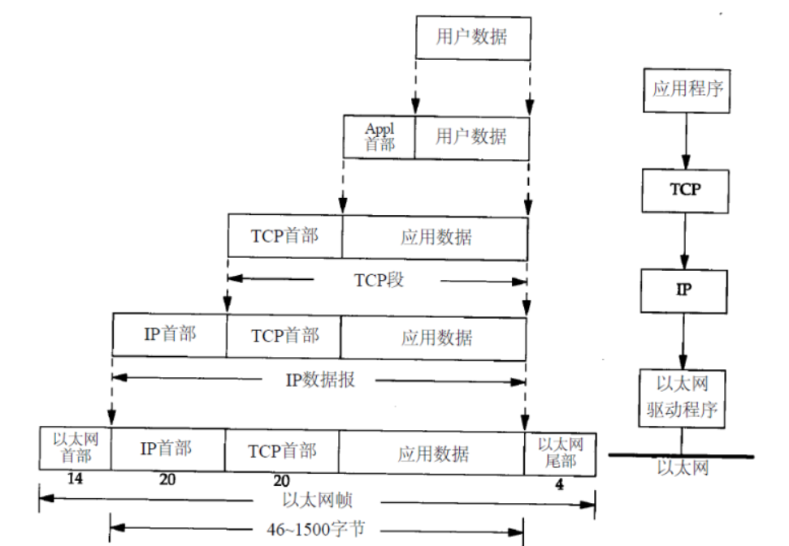
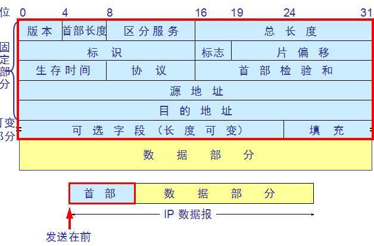
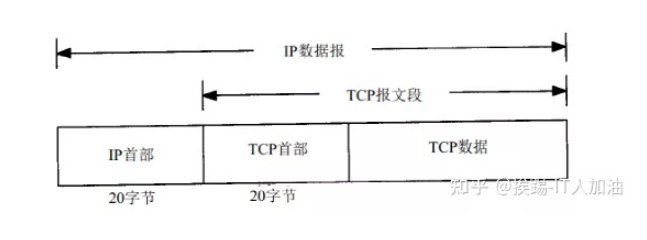
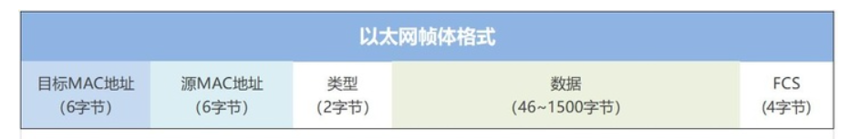
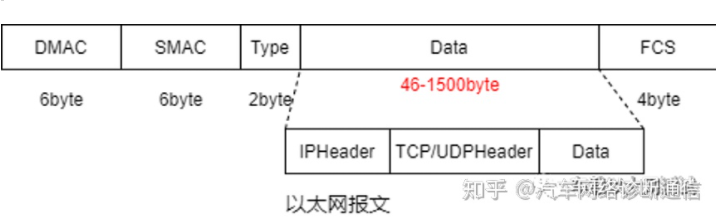
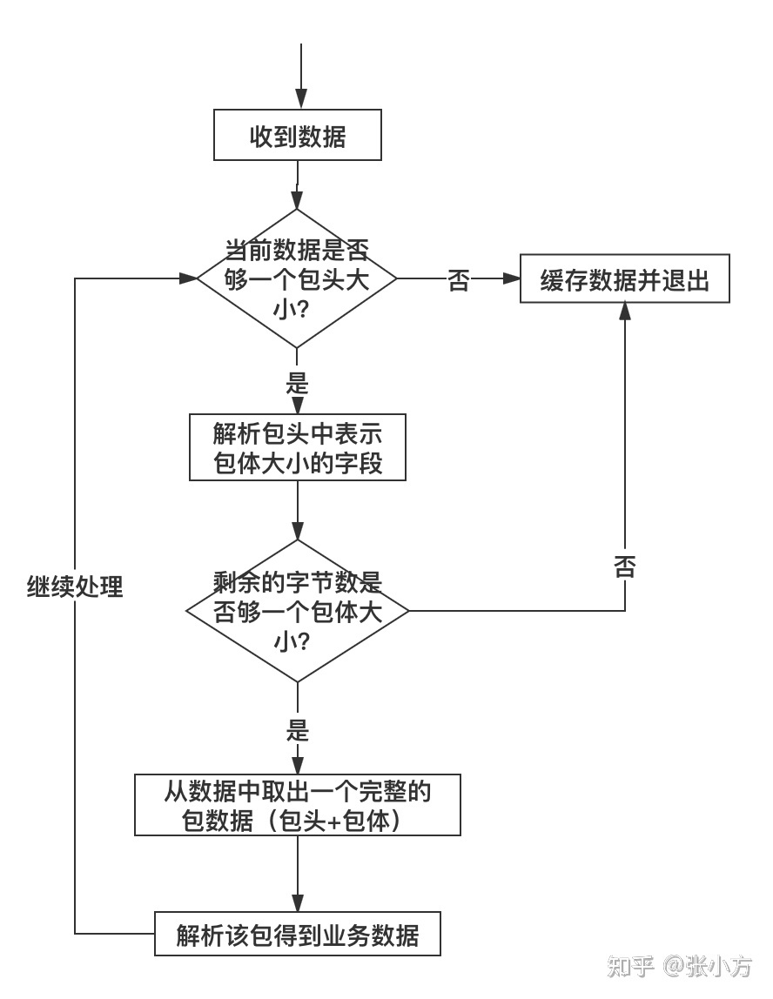
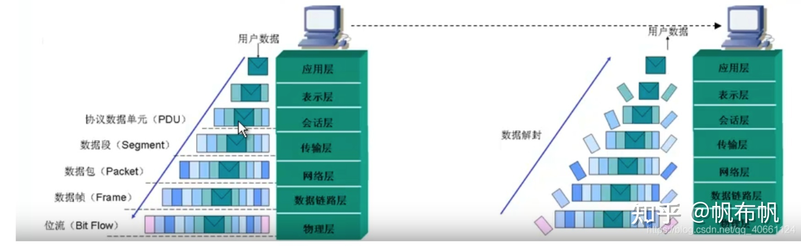

# 计算机网络

### 五层/七层网络模型

#### OSI七层模型

**应用层：为应用程序或用户请求提供各种请求服务。**OSI参考模型最高层，也是最靠近用户的一层，为计算机用户、各种应用程序以及网络提供接口，也为用户直接提供各种网络服务。

**表示层：[数据编码](https://www.zhihu.com/search?q=数据编码&search_source=Entity&hybrid_search_source=Entity&hybrid_search_extra={"sourceType"%3A"article"%2C"sourceId"%3A"143654140"})、格式转换、数据加密。**提供各种用于应用层数据的编码和转换功能,确保一个系统的应用层发送的数据能被另一个系统的应用层识别。如果必要，该层可提供一种标准表示形式，用于将计算机内部的多种数据格式转换成通信中采用的标准表示形式。数据压缩和加密也是表示层可提供的转换功能之一。

**会话层：创建、管理和维护会话。**接收来自传输层的数据，负责建立、管理和终止表示层实体之间的[通信会话](https://www.zhihu.com/search?q=通信会话&search_source=Entity&hybrid_search_source=Entity&hybrid_search_extra={"sourceType"%3A"article"%2C"sourceId"%3A"143654140"})，支持它们之间的数据交换。该层的通信由不同设备中的应用程序之间的服务请求和响应组成。

**传输层：数据通信。**建立主机端到端的链接，为会话层和网络层提供端到端可靠的和透明的数据传输服务，确保数据能完整的传输到网络层。

**网络层：IP选址及路由选择。**通过路由选择算法，为报文或通信子网选择最适当的路径。控制数据链路层与传输层之间的信息转发，建立、维持和终止网络的连接。数据链路层的数据在这一层被转换为数据包，然后通过路径选择、分段组合、顺序、进/出路由等控制，将信息从一个网络设备传送到另一个网络设备。

**数据链路层：提供介质访问和链路管理。**接收来自物理层的位流形式的数据，封装成帧，传送到网络层；将网络层的数据帧，拆装为位流形式的数据转发到物理层；负责建立和管理节点间的链路，通过各种控制协议，将有差错的物理信道变为无差错的、能可靠传输数据帧的[数据链路](https://www.zhihu.com/search?q=数据链路&search_source=Entity&hybrid_search_source=Entity&hybrid_search_extra={"sourceType"%3A"article"%2C"sourceId"%3A"143654140"})。

**物理层：管理通信设备和网络媒体之间的互联互通。**传输介质为数据链路层提供物理连接，实现[比特流](https://www.zhihu.com/search?q=比特流&search_source=Entity&hybrid_search_source=Entity&hybrid_search_extra={"sourceType"%3A"article"%2C"sourceId"%3A"143654140"})的透明传输。实现相邻计算机节点之间比特流的透明传送，屏蔽具体传输介质和物理设备的差异。

#### TCP/IP五层模型

#### 交换机、路由器

​		交换机是数据链路层的设备，它利用MAC地址寻址，负责局域网内的数据通信。三层交换机是利用网络层中IP包的包头信息来对后续数据业务流进行标记，具有同一标记的业务流的后续报文被交换到第二层数据链路层，从而打通源IP地址和目的IP地址之间的一条通路。三层交换机就没有必要每次将接收到的数据包进行拆包来判断路由，而是直接将数据包进行转发，将数据流进行交换。

​		具备了一些基本的路由功能的交换机。三层交换机同时具备了**数据交换**和**路由转发**两种功能，但其主要功能还是**数据交换**

​		路由器在网络层，虽然也适用于局域网之间的连接，但它的路由功能更多的体现在不同类型**网络之间**的互联上，如局域网与广域网之间的连接、不同协议的网络之间的连接等，优势在于选择最佳路由、负荷分担、链路备份及和其他网络进行路由信息的交换等。

### ----------------------------

### 三次握手四次挥手

#### 三次握手

##### 三次握手过程

**第一次握手**：客户端给服务端发一个 **SYN 报文**，并指明客户端的初始化序列号 ISN©。此时客户端处于 SYN_SEND 状态。

首部的同步位SYN=1，初始序号seq=x，SYN=1的报文段不能携带数据，但要消耗掉一个序号。

**第二次握手**：服务器收到客户端的 SYN 报文之后，会以自己的 SYN 报文作为应答，并且也是指定了自己的初始化序列号 ISN(s)。同时会把客户端的 ISN + 1 作为ACK 的值，表示自己已经收到了客户端的 SYN，此时服务器处于 SYN_REVD 的状态。

在确认报文段中SYN=1，ACK=1，确认号ack=x+1，初始序号seq=y。

**第三次握手**：客户端收到 SYN 报文之后，会发送一个 ACK 报文，当然，也是一样把服务器的 ISN + 1 作为 ACK 的值，表示已经收到了服务端的 SYN 报文，此时客户端处于 ESTABLISHED 状态。服务器收到 ACK 报文之后，也处于 ESTABLISHED 状态，此时，双方已建立起了连接。

确认报文段ACK=1，确认号ack=y+1，序号seq=x+1（初始为seq=x，第二个报文段所以要+1），ACK报文段可以携带数据，不携带数据则不消耗序号。

发送第一个SYN的一端将执行主动打开（active open），接收这个SYN并发回下一个SYN的另一端执行被动打开（passive open）。

在socket编程中，客户端执行connect()时，将触发三次握手。

##### 什么是半连接队列？

​		服务器第一次收到客户端的 SYN 之后，就会处于 **SYN_RCVD** 状态，此时双方还没有完全建立其连接，服务器会把此种状态下请求连接放在一个队列里，我们把这种队列称之为半连接队列。

​		当然还有一个全连接队列，就是已经完成三次握手，建立起连接的就会放在全连接队列中。如果队列满了就有可能会出现丢包现象。

##### *两次握手为什么不行！！！！！*

​		现实网络是不可靠的，可能会存在丢包、超时损坏等问题。握手的目的是为了保证TCP的可靠传输，两次握手行 ，但问题是不够可靠。

​		假如问题出现在第一次握手，C向S发请求连接，但中途超时，C在规定时间内没有收到来自S的确认应答，C可能会放弃连接，但如果S随后收到了这个超时的包，并发送应答信号，那对于S来说两次握手成功建立连接，系统创建线程和分配内存处理后面的通信，而此时客户端放弃连接了，浪费服务器资源。	

​		如果问题是发送在第二次握手，加入C给S发送一个连接请求，S也正常收到了连接请求发送确认应答，按照两次握手的说法，那S认为连接已经建立，可此时只能保证客户端到服务端是可达的。而不能保证服务端到客户端是可达的。如果这时开始发送数据分组，但如果因为网络原因，C没有收到S的确认应答，C认为连接还尚未形成，S已经发送的数据可能会被忽略，而等待确认应答，造成一定程度的死锁。

​		实际上这两种可能都可以通过TCP报文可选项字段项设置时间戳、或者重发确认应答来解决。但都存在一定程度的开销或是我的理解是还不那么可靠。而三次握手就足够保证客户端、服务端之间互相可达，能够实现很高的可靠程度。

##### 四次握手为什么不行

​		三次已经能够保证客户端、服务端各自收发能力的正常了，没有必要再多握

##### **ISN(Initial Sequence Number)是固定的吗？**

​		当一端为建立连接而发送它的SYN时，它为连接选择一个初始序号。ISN随时间而变化，因此每个连接都将具有不同的ISN。ISN可以看作是一个[32比特](https://www.zhihu.com/search?q=32比特&search_source=Entity&hybrid_search_source=Entity&hybrid_search_extra={"sourceType"%3A"article"%2C"sourceId"%3A"86426969"})的计数器，每4ms加1 。这样选择序号的目的在于防止在网络中被延迟的分组在以后又被传送，而导致某个连接的一方对它做错误的解释。

​		三次握手的其中一个重要功能是客户端和服务端交换 ISN(Initial Sequence Number)，以便让对方知道接下来接收数据的时候如何按序列号组装数据。如果 ISN 是固定的，攻击者很容易猜出后续的确认号，因此 ISN 是动态生成的。

##### **SYN攻击是什么？**

​		服务器端的资源分配是在二次握手时分配的，而客户端的资源是在完成三次握手时分配的，所以服务器容易受到SYN洪泛攻击。SYN攻击就是Client在短时间内伪造大量不存在的IP地址，并向Server不断地发送SYN包，Server则回复确认包，并等待Client确认，由于源地址不存在，因此Server需要不断重发直至超时，这些伪造的SYN包将长时间占用未连接队列，导致正常的SYN请求因为队列满而被丢弃，从而引起网络拥塞甚至系统瘫痪。SYN 攻击是一种典型的 DoS/DDoS 攻击。

​		检测 SYN 攻击非常的方便，当你在服务器上看到大量的半连接状态时，特别是源IP地址是随机的，基本上可以断定这是一次SYN攻击。在 Linux/Unix 上可以使用系统自带的 netstats 命令来检测 SYN 攻击。

####  四次挥手

##### 四次挥手过程

​		刚开始双方都处于 ESTABLISHED 状态，假如是客户端先发起关闭请求。四次挥手的过程如下：

​		**第一次挥手**：客户端发送一个 FIN 报文，报文中会指定一个序列号。此时客户端处于 FIN_WAIT1 状态。即发出连接释放报文段（FIN=1，序号seq=u），并停止再发送数据，主动关闭TCP连接，进入**FIN_WAIT1**（终止等待1）状态，等待服务端的确认。

​		**第二次挥手**：服务端收到 FIN 之后，会发送 ACK 报文，且把客户端的序列号值 +1 作为 ACK 报文的序列号值，表明已经收到客户端的报文了，此时服务端处于 **CLOSE_WAIT** 状态。即服务端收到连接释放报文段后即发出确认报文段（ACK=1，确认号ack=u+1，序号seq=v），服务端进入**CLOSE_WAIT**（关闭等待）状态，此时的**TCP处于半关闭状态，**客户端到服务端的连接释放。客户端收到服务端的确认后，进入FIN_WAIT2（终止等待2）状态，**等待服务端发出的连接释放报文段。**

​		**第三次挥手**：如果服务端也想断开连接了，和客户端的第一次挥手一样，发给 FIN 报文，且指定一个序列号。此时服务端处于 LAST_ACK 的状态。即服务端没有要向客户端发出的数据，服务端发出连接释放报文段（FIN=1，ACK=1，序号seq=w，确认号ack=u+1），服务端进入**LAST_ACK（**最后确认）状态，等待客户端的确认。

​		**第四次挥手**：客户端收到 FIN 之后，一样发送一个 ACK 报文作为应答，且把服务端的序列号值 +1 作为自己 ACK 报文的序列号值，此时客户端处于 TIME_WAIT 状态。需要过一阵子以确保服务端收到自己的 ACK 报文之后才会进入 CLOSED 状态，**服务端收到 ACK 报文之后，就处于关闭连接了，处于 CLOSED 状态。**即客户端收到服务端的连接释放报文段后，对此发出确认报文段（ACK=1，seq=u+1，ack=w+1），客户端进入TIME_WAIT（时间等待）状态。此时TCP未释放掉，需要经过时间等待计时器设置的时间2MSL后，客户端才进入CLOSED状态。

收到一个FIN只意味着在这一方向上没有数据流动。客户端执行主动关闭并进入TIME_WAIT是正常的，服务端通常执行被动关闭，不会进入TIME_WAIT状态。

在socket编程中，任何一方执行close()操作即可产生挥手操作。

##### **挥手为什么需要四次？**

​		**由于TCP连接是全双工的，因此每个方向都需要单独关闭，每个方向都要发送关闭请求，而另一方向都要确认。2×2**

​		因为当服务端收到客户端的SYN连接请求报文后，可以直接发送SYN+ACK报文。其中ACK报文是用来应答的，SYN报文是用来同步的。但是关闭连接时，当服务端收到FIN报文时，很可能并不会立即关闭SOCKET，所以只能先回复一个ACK报文，告诉客户端，“你发的FIN报文我收到了”。只有**等到我服务端所有的报文都发送完了**，我才能发送FIN报文，因此不能一起发送。故需要四次挥手。

##### TimeWait有什么作用

​		主要有两个作用 

​		一、如果没有TimeWait，没有这个等待时间，假如客户端返回给服务端的确认信号丢失，服务端就没法确认客户端是否收到了FIN信号，服务端就没法进入到正常的Close状态，服务端也没法释放资源

​		二、确保本连接所有的报文段都从网络上消失，防止出现下一个新的连接中出现这种旧的报文段。

##### TimeWait为什么过多，怎么解决

​		在**高并发短连接**的TCP服务器上，当服务器处理完请求后立刻主动正常关闭连接。这个场景下会出现大量socket处于TIME_WAIT状态。如果客户端的并发量持续很高，此时部分客户端就会显示连接不上。服务端的端口被用尽，无法发起新的连接。

​		开启重用，运行在TIME-WAIT sockets重新用于新的TCP连接，修改timewait等待时间。

##### **MSL等待状态**

​		TIME_WAIT状态也成为2MSL等待状态。每个具体TCP实现必须选择一个报文段**最大生存时间MSL**（Maximum Segment Lifetime），它是任何报文段被丢弃前在网络内的最长时间。这个时间是有限的，因为TCP报文段以IP数据报在网络内传输，而IP数据报则有限制其生存时间的TTL字段。

​		为了保证客户端发送的最后一个ACK报文段能够到达服务器。因为这个ACK有可能丢失，从而导致处在[LAST-ACK](https://www.zhihu.com/search?q=LAST-ACK&search_source=Entity&hybrid_search_source=Entity&hybrid_search_extra={"sourceType"%3A"article"%2C"sourceId"%3A"86426969"})状态的服务器收不到对[FIN-ACK](https://www.zhihu.com/search?q=FIN-ACK&search_source=Entity&hybrid_search_source=Entity&hybrid_search_extra={"sourceType"%3A"article"%2C"sourceId"%3A"86426969"})的确认报文。服务器会超时重传这个FIN-ACK，接着客户端再重传一次确认，重新启动时间等待计时器。最后客户端和服务器都能正常的关闭。**假设客户端不等待2MSL，而是在发送完ACK之后直接释放关闭，一但这个ACK丢失的话，服务器就无法正常的进入关闭连接状态**。除此之外，客户端在发送完最后一个ACK报文段后，再经过2MSL，就可以使本连接持续的时间内所产生的所有报文段都从网络中消失，使下一个新的连接中不会出现这种旧的连接请求报文段。

​		这种2MSL等待的另一个结果是这个TCP连接在2MSL等待期间，定义这个连接的插口（客户的IP地址和端口号，服务器的IP地址和端口号）不能再被使用。这个连接只能在2MSL结束后才能再被使用。

### ---------------------------

### TCP & UDP

#### TCP可靠传输的保证：

1. 检验和
2. 超时重传
3. 滑动窗口控制
4. 拥塞控制

基于TCP的协议：FTP,SSH,POP3

#### TCP

- TCP 提供一种**面向连接的、可靠的**字节流服务
- 在一个 TCP 连接中，仅有**两方**进行彼此通信。广播和多播不能用于 TCP
- TCP 使用校验和，确认和重传机制来保证可靠传输
- TCP 给数据分节进行排序，并使用累积确认保证数据的顺序不变和非重复
- TCP 使用滑动窗口机制来实现流量控制，通过动态改变窗口的大小进行拥塞控制

##### ACK和超时重发机制

​		TCP首先会按照顺序给发送的数据标上号码。TCP每发送一个数据报，都会**期待一个接收端ACK**的回复，我们就知道接收端已经收到消息了。如果短时间内没有收到ACK，那么TCP就会对消息进行自动重发；TCP并不会无脑的进行重发，再尝试了一段时间后如果还是没有收到ACK，这时候它就会**单方面的断开自己的链接**

​		未收到ACK就说明消息一定就丢了吗？也不一定，有可能接收端收到消息了，返回ACK的途中发生了丢失。这个时候这个时候依然会进行超时重发。接收端可能会收到同样的消息，没关系我们不是对发送的数据进行编号了吗，如果接收端收到重复消息直接丢失就可以了。

##### 滑动窗口

​		为每个数据包确认应答的缺点：包的往返时间长，网络的吞吐量越低

​		窗口的实现实际上是操作系统开辟的一个缓存空间，发送方主机在等到确认应答返回之前，**必须在缓冲区中保留已发送的数据**。如果按期收到确认应答，此时数据就**可以从缓存区清除。**

​		TCP 头里有一个字段叫 `Window`，也就是窗口大小。

​		这个字段是接收端告诉发送端自己还有多少缓冲区可以接收数据。于是发送端就可以根据这个接收端的处理能力来发送数据，而不会导致接收端处理不过来。

###### 		发送方

###### 		接收方

​		接收窗口的大小约等于发送窗口的大小，新的接收窗口大小，是通过TCP报文中的Windows字段来告诉发送方，这个过程存在时延，所以接收窗口约等于发送窗口

##### **流量控制**

​		当服务端系统资源非常紧张的时候，操心系统可能会直接减少了接收缓冲区大小，这时应用程序又无法及时读取缓存数据，那么这时候就有严重的事情发生了，会出现数据包丢失的现象。

​		**为了防止这种情况发生，TCP 规定是不允许同时减少缓存又收缩窗口的，而是采用先收缩窗口，过段时间再减少缓存，这样就可以避免了丢包情况。**

​		TCP 为每个连接设有一个持续定时器，**只要 TCP 连接一方收到对方的零窗口通知，就启动持续计时器。**如果持续计时器超时，就会发送**窗口探测 ( Window probe ) 报文**，而对方在确认这个探测报文时，给出自己现在的接收窗口大小。

##### 糊涂窗口综合症

​		如果接收方太忙了，来不及取走接收窗口里的数据，那么就会导致发送方的发送窗口越来越小。到最后，**如果接收方腾出几个字节并告诉发送方现在有几个字节的窗口，而发送方会义无反顾地发送这几个字节，这就是糊涂窗口综合症**。要知道，我们的 `TCP + IP` 头有 `40` 个字节，为了传输那几个字节的数据，要达上这么大的开销，这太不经济了

###### 接收方策略：

​		当「窗口大小」小于 min( MSS，缓存空间/2 ) ，也就是小于 MSS 与 1/2 [缓存大小](https://www.zhihu.com/search?q=缓存大小&search_source=Entity&hybrid_search_source=Entity&hybrid_search_extra={"sourceType"%3A"article"%2C"sourceId"%3A"133307545"})中的最小值时，就会向发送方通告窗口为 `0`，也就阻止了发送方再发数据过来。等到接收方处理了一些数据后，窗口大小 >= MSS，或者接收方缓存空间有一半可以使用，就可以把窗口打开让发送方发送数据过来。

###### 发送方策略

​		使用 Nagle 算法，该算法的思路是延时处理，它满足以下两个条件中的一条才可以发送数据：

- 要等到窗口大小 >= `MSS` 或是 [数据大小](https://www.zhihu.com/search?q=数据大小&search_source=Entity&hybrid_search_source=Entity&hybrid_search_extra={"sourceType"%3A"article"%2C"sourceId"%3A"133307545"}) >= `MSS`
- 收到之前发送数据的 `ack` 回包

##### **拥塞控制**

​		前面的流量控制是避免「发送方」的数据填满「接收方」的缓存，但是并不知道网络的中发生了什么。一般来说，计算机网络都处在一个共享的环境。因此也有可能会因为其他主机之间的通信使得网络拥堵。

​		**拥塞控制**，控制的目的就是**避免「发送方」的数据填满整个网络。**拥塞窗口 cwnd**是发送方维护的一个的状态变量，它会根据**网络的拥塞程度动态变化的。

​		我们在前面提到过发送窗口 `swnd` 和接收窗口 `rwnd` 是约等于的关系，那么由于加入了拥塞窗口的概念后，此时发送窗口的值是swnd = **min(cwnd, rwnd)**，也就是拥塞窗口和接收窗口中的最小值。

​		其实只要「发送方」没有在规定时间内接收到 ACK 应答报文，也就是**发生了超时重传，就会认为网络出现了用拥塞。**

###### 拥塞控制四个算法

1. 慢启动
2. 拥塞避免
3. 拥塞发生
4. 快速恢复

- **慢启动**

  

  

- **拥塞避免**

拥塞避免算法就是将原本慢启动算法的指数增长变成了线性增长，还是增长阶段，但是增长速度缓慢了一些。就这么一直增长着后，**网络就会慢慢进入了拥塞的状况了**，于是就会出现丢包现象，这时就需要对丢失的数据包进行重传。当触发了重传机制，也就进入了「拥塞发生算法」。

- **拥塞发生**

  

  ​		接着，就重新开始慢启动，慢启动是会突然减少数据流的。这真是一旦「超时重传」，马上回到解放前。但是这种方式太激进了，**反应也很强烈，会造成网络卡顿**。

  

- **快速恢复**

  

  

##### TCP如何保证可靠性传输

​		**TCP 报文：20字节固定字段，40字节可选字段**	

​		**IP数据报：20字IP首部 + TCP报文段**	

​	

​		TCP主要提供了检验和、序列号/确认应答、超时重传、最大消息长度、滑动窗口控制等方法实现了可靠性传输。	

​		检验和：

#### UDP

基于UDP的协议：voip，DHCP

- UDP 是**无连接**的，即发送数据之前不需要建立连接(发送数据结束时也没有连接可释放)，减少了开销和发送数据之前的时延
- UDP 使用`尽最大努力交付`，即不保证可靠交付，主机不需要维持复杂的连接状态表
- UDP 是`面向报文`的，发送方的 UDP 对应用程序交下来的报文，在添加首部后就向下交付 IP 层。UDP 对[应用层](https://www.zhihu.com/search?q=应用层&search_source=Entity&hybrid_search_source=Entity&hybrid_search_extra={"sourceType"%3A"article"%2C"sourceId"%3A"64154915"})交下来的报文，既不合并，也不拆分，而是`保留这些报文的边界`
- UDP `没有拥塞控制`，网络出现的拥塞不会使源主机的发送速率降低。这对某些实时应用是很重要的
- UDP 支持一对一、一对多、多对一和多对多的交互通信
- UDP 的`首部开销小`，只有8个字节，比 TCP 的20个字节的首部要短

- `源端口` 源端口号。在需要对方回信时。不需要时可用全0
- `目的端口` 目的端口号。这在终点交付报文时必须使用
- `长度` UDP 用户数据报的长度，其最小值是8(仅有首部)
- `检验和` 检测 UDP 用户数据报在传输中是否有错。有错就丢弃

#### **小结TCP与UDP的区别：**

1、基于连接与无连接；

2、对系统资源的要求（TCP较多，UDP少）；

3、UDP程序结构较简单；

4、流模式与数据报模式 ；TCP面向字节流，以字节为单位；udp是一种面向报文的链接；udp数据传输的单位是报文，而且不会对数据做任何的拆分和拼接操作。增加一个udp头并且交给网络层。在接收端，udp收到网络层的数据之后，除去ip（网络层协议）数据报头部后便交给应用层，不会做任何的拼接操作

5、TCP保证数据正确性，UDP可能丢包；

6、TCP保证数据顺序，UDP不保证。

### ---------------------------

### http1 /1.1 /2

​		HTTP是Hyper Text Transfer Protocol（超文本传输协议）的缩写。HTTP协议用于从WWW服务器传输超文本到本地浏览器的传送协议。它可以使浏览器更加高效，使网络传输减少。它不仅保证计算机正确快速地传输超文本文档，还确定传输文档中的哪一部分，以及哪部分内容首先显示(如文本先于图形)等。HTTP是一个[应用层协议](https://www.zhihu.com/search?q=应用层协议&search_source=Entity&hybrid_search_source=Entity&hybrid_search_extra={"sourceType"%3A"article"%2C"sourceId"%3A"89889707"})，由请求和响应构成，是一个标准的[客户端服务器模型](https://www.zhihu.com/search?q=客户端服务器模型&search_source=Entity&hybrid_search_source=Entity&hybrid_search_extra={"sourceType"%3A"article"%2C"sourceId"%3A"89889707"})。HTTP是一个**无状态的协议。**

#### HTTP1.0

​		默认是短链接的，TCP每次都要经过**三次握手，四次挥手，慢启动，**这都需要去消耗我们非常多的资源的 ，

#### HTTP1.1

​		默认就使用持久化连接来解决：**建立一次连接，多次请求均由这个连接完成**！(如果阻塞了，还是会开新的TCP连接的。可以有多个TCP连接)

#### **HTTP/1.0和1.1的区别**

1. **缓存处理**：HTTP/1.0 使用 Pragma:no-cache + Last-Modified/If-Modified-Since来作为缓存判断的标准；HTTP/1.1 引入了更多的缓存控制策略：Cache-Control、Etag/If-None-Match等
2. **错误状态管理**：HTTP/1.1新增了24个错误状态响应码，如409（Conflict）表示请求的资源与资源的当前状态发生冲突；410（Gone）表示服务器上的某个资源被永久性的删除。
3. **范围请求**：HTTP/1.1在请求头引入了range头域，它允许只请求资源的某个部分，即返回码是206（Partial Content），这样就方便了开发者自由的选择以便于充分利用带宽和连接，支持断点续传
4. **Host头**：HTTP1.0中认为每台服务器都绑定一个唯一的IP地址，因此，请求消息中的URL并没有传递主机名（hostname）。但随着虚拟主机技术的发展，在一台物理服务器上可以存在多个虚拟主机（Multi-homed Web Servers），并且它们共享一个IP地址。HTTP1.1的请求消息和响应消息都应支持Host头域，且请求消息中如果没有Host头域会报告一个错误（400 Bad Request）。有了Host字段，就可以将请求发往同一台服务器上的不同网站，为虚拟主机的兴起打下了基础
5. **持久连接**：HTTP/1.1 最大的变化就是引入了持久连接（persistent connection），在HTTP/1.1中默认开启 Connection: keep-alive，即TCP连接默认不关闭，可以被多个请求复用

​		客户端和服务器发现对方一段时间没有活动，就可以主动关闭连接。不过，规范的做法是，客户端在最后一个请求时，发送Connection: close，明确要求服务器关闭TCP连接。

###### 管道机制

​		1.1 版还引入了[管道机制](https://www.zhihu.com/search?q=管道机制&search_source=Entity&hybrid_search_source=Entity&hybrid_search_extra={"sourceType"%3A"article"%2C"sourceId"%3A"89889707"})（pipelining），即在同一个TCP连接里面，客户端可以同时发送多个请求。这样就进一步改进了HTTP协议的效率。

​		举例来说，客户端需要请求两个资源。以前的做法是，在同一个TCP连接里面，先发送A请求，然后等待服务器做出回应，收到后再发出B请求。管道机制则是允许浏览器同时发出A请求和B请求，但是服务器还是**按照顺序**，先回应A请求，完成后再回应B请求。

​		但是同一个TCP连接里面，所有的数据通信是按次序进行的。服务器只有处理完一个回应，才会进行下一个回应。要是前面的回应特别慢，后面就会有许多请求排队等着。这称为**"队头堵塞"（Head-of-line blocking）**。

#### **HTTP/2**

​		HTTP/2协议只在HTTPS环境下才有效，升级到HTTP/2，必须先启用HTTPS。HTTP/2解决了HTTP/1.1的性能问题，主要特点如下：

1. **二进制分帧**：HTTP/1.1的头信息是文本（ASCII编码），数据体可以是文本，也可以是二进制；HTTP/2 头信息和数据体都是二进制，统称为“帧”：头信息帧和数据帧；

   

2. **多路复用（双工通信）**：通过单一的 HTTP/2 连接发起多重的请求-响应消息，即**在一个连接里，客户端和浏览器都可以同时发送多个请求和响应，而不用按照顺序一一对应，这样避免了“队头堵塞”**。HTTP/2 把 HTTP 协议通信的基本单位缩小为一个一个的帧，这些帧对应着逻辑流中的消息。并行地在同一个 TCP 连接上双向交换消息。

3. **数据流**：因为 HTTP/2 的数据包是不按顺序发送的，同一个连接里面连续的数据包，可能属于不同的回应。因此，必须要对数据包做标记，指出它属于哪个回应。HTTP/2 将每个请求或回应的所有数据包，称为一个数据流（stream）。**每个数据流都有一个独一无二的编号**。数据包发送的时候，都必须标记数据流ID，用来区分它属于哪个数据流。另外还规定，客户端发出的数据流，ID一律为奇数，服务器发出的，ID为偶数。数据流发送到一半的时候，客户端和服务器都可以发送信号（RST_STREAM帧），取消这个数据流。HTTP/1.1取消数据流的唯一方法，就是关闭TCP连接。这就是说，HTTP/2 可以取消某一次请求，同时保证TCP连接还打开着，可以被其他请求使用。客户端还可以指定数据流的优先级。**优先级越高，服务器就会越早回应。**

4. **首部压缩**：HTTP 协议不带有状态，每次请求都必须附上所有信息。所以，请求的很多字段都是重复的，，一模一样的内容，每次请求都必须附带，这会浪费很多带宽，也影响速度。HTTP/2 对这一点做了优化，**引入了头信息压缩机制**（header compression）。一方面，头信息压缩后再发送（SPDY 使用的是通用的DEFLATE 算法，而 HTTP/2 则使用了专门为首部压缩而设计的 HPACK 算法）。；另一方面，客户端和服务器同时**维护一张头信息表**，所有字段都会存入这个表，生成一个索引号，以后就不发送同样字段了，只发送索引号，这样就提高速度了。

5. **服务端推送**：HTTP/2 允许服务器未经请求，主动向客户端发送资源，这叫做服务器推送（server push）。常见场景是客户端请求一个网页，这个网页里面包含很多静态资源。正常情况下，客户端必须收到网页后，解析HTML源码，发现有静态资源，再发出静态资源请求。其实，服务器可以预期到客户端请求网页后，很可能会再请求静态资源，所以就主动把这些静态资源随着网页一起发给客户端了。

#### HTTP/3 

​		将TCP协议换成了UDP协议

### ---------------------------

### websocket

1. WebSocket和HTTP都是基于TCP协议的两个不同的协议
2. WebSocket依赖于HTTP连接

​		每个WebSocket连接都始于一个HTTP请求。具体来说，WebSocket协议在第一次握手连接时，通过HTTP协议在传送WebSocket支持的版本号，协议的字版本号，原始地址，[主机地址](https://www.zhihu.com/search?q=主机地址&search_source=Entity&hybrid_search_source=Entity&hybrid_search_extra={"sourceType"%3A"article"%2C"sourceId"%3A"95622141"})等等一些列字段给服务器端：利用Upgrade首部，将当前的http请求升级到websocket协议。

​		websocket的出现就是为了增强http通信的功能，实现全双工通信，因此它基于HTTP，加入服务器不支持websocket的也能建立Http通信。

### ---------------------------

### HTTP建立连接过程

#### http 和 https的区别

HTTPS在HTTP的基础上加入了SSL/TLS协议

- 端口不同

​		HTTP：80端口			HTTPS：443端口

- 安全性不同

- 网站申请流程不同

**一、客户端发起HTTPS连接**

​		当用户在浏览器（后文称作客户端）地址栏敲击[https://www.scwipe.com](https://link.zhihu.com/?target=https%3A//www.scwipe.com)时，浏览器去到dns服务器获取此url对应的ip，然后客户端连接上服务端的443端口，将此请求发送给到服务端，此时客户端同时将自己支持的加密算法带给服务端；

**二、服务端发送证书**

​		在讲这一段之前插播一条小知识点：私钥加密的密文只有公钥才能解开；公钥加密的密文只有私钥才能解开。

​		服务端收到这套加密算法的时候，和自己支持的加密算法进行对比（也就是和自己的私钥进行对比），如果不符合，就断开连接；如果符合，服务端就将CA证书发送给客户端，此证书中包括了数字证书包含的内容：1、证书颁发机构；2、使用机构；3、公钥；4、有效期；5、签名算法；6、签名hash算法；7、指纹算法；8、指纹。

​		这里服务端发送的东西是用私钥进行加密的，公钥都能解开，并不能保证发送的数据包不被别人看到，所以后面的过程会和客户端商量选择一个对称加密（只能用私钥解开，这里详情请移步[非对称、对称加解密相关问题](https://link.zhihu.com/?target=https%3A//blog.csdn.net/qq_24601199/article/details/104338962)）来对传输的数据进行加密。

**三、客户端验证服务端发来的证书**

**1、验证证书**

​		客户端验证收到的证书，包括发布机构是否合法、过期，证书中包含的网址是否与当前访问网址一致等等。

**2、生成随机数（此随机数就是后面用的对称加密的私钥）**

​		客户端验证证书无误后（或者接受了不信任的证书），会生成一个随机数，用服务端发过来的公钥进行加密。如此一来，此随机数只有服务端的私钥能解开了。

**3、生成握手信息**

​		用证书中的签名hash算法取握手信息的hash值，然后用生成的随机数对[握手信息和握手信息的hash值]进行加密，然后用公钥将随机数进行加密后，一起发送给服务端。其中计算握手信息的hash值，目的是为了保证传回到服务端的握手信息没有被篡改。

**四、服务端接收随机数加密的信息，并解密得到随机数，验证握手信息是否被篡改。**

​		服务端收到客户端传回来的用随机数加密的信息后，先**用私钥解密随机数**，然后用解密得到的**随机数解密握手信息**，获取握手信息和握手信息的hash值，计算自己发送的握手信息的hash值，与客户端传回来的进行对比验证。

​		如果验证无误，同样使用随机字符串加密握手信息和握手信息hash值发回给到客户端

**五、客户端验证服务端发送回来的握手信息，完成握手**

​		客户端收到服务端发送过来的握手信息后，用开始自己生成的随机数进行解密，验证被随机数加密的握手信息和握手信息hash值。

​		验证无误后，握手过程就完成了，从此服务端和客户端就开始用那串随机数进行对称加密通信了（常用的对称加密算法有AES）

- 非对称加密算法：RSA，DSA/DSS
- 对称加密算法：AES，RC4，3DES
- HASH算法：MD5，SHA1，SHA256

**回答：**

​		只用对称加密的话，如果由服务器生成一个密钥传给浏览器的时候被劫持了，那么它就能用密钥解开双方传输的任何内容了。而浏览器又不能储存所有网站的密钥，因此只用对称加密无法满足；

​		只采用非对称加密安全性会比对称加密好，但每次传输都用非对称加密算法非常耗时;

​		采用非对称加密+对称加密，一开始通过非对称加密生成只有服务器和客户端都知道的密钥X，后面传输过程中用密钥解密即可。

​		另外在数据传输过程中可能存在中间人攻击，中间人劫持到服务器原本发送给客户端的公钥A，并替换成自己的公钥B，再发送给客户端，这样一来虽然生成了X，但同时中间人也获得了密钥X。出现这种情况的根本原因是客户端无法确认收到的公钥是不是服务器的。

​		为了防止非对称过程产生的中间人攻击，需要对服务器公钥和服务器身份进行配对的数字认证，网站需要向**CA机构**申领一份**数字证书**，数字证书里含有证书持有者信息、公钥信息等。首先对明文数据进行Hash,再用CA机构是私钥加密得到数字签名S，浏览器拿到证书后，用CA公钥对S解密得到S‘，在用证书指明的Hash算法对明文T Hash得到T’，此时比较S’是否等于T’，等于则表明证书可信。

### ---------------------------

### 长连接和短链接(怎么实现的、区别以及应用场景) 

​		HTTP指的长短连接其实是TCP的长段连接		

​		长连接意味着进行一次数据传输后，不关闭连接，长期保持连通状态。如果两个应用程序之间有新的数据需要传输，则直接复用这个连接，无需再建立一个新的连接。Connection都是keep-alive

​		请求了博客园的一个网页，这个网页里肯定还包含了CSS、JS等等一系列资源，如果你是短连接（也就是每次都要重新建立TCP连接）的话，每打开一个网页，可能要建立多次TCP连接

​		长连接通过保活机制来实现，保活机制会定时发送探测报文来识别对方是否可达，一般用于服务端探测客户端的场景，一旦识别客户端不可达，则断开连接，缓解服务端压力。

​		短连接意味着每一次的数据传输都需要建立一个新的连接，用完再马上关闭它。下次再用的时候重新建立一个新的连接，如此反复。

长连接的三个主要因素：**高频、服务端主动推送和有状态**   交易系统

短连接的两个主要因素：**低频、无状态**。电子书阅读

### ---------------------------

### **UNIX/Linux 中的 socket 是什么？**

​		在 UNIX/Linux 系统中，为了统一对各种硬件的操作，简化接口，不同的硬件设备也都被看成一个文件。对这些文件的操作，等同于对磁盘上普通文件的操作。UNIX/Linux 中的一切都是文件！

​		 为了表示和区分已经打开的文件，UNIX/Linux 会给每个文件分配一个 ID，这个 ID 就是一个整数，被称为[**文件描述符**](https://www.zhihu.com/search?q=文件描述符&search_source=Entity&hybrid_search_source=Entity&hybrid_search_extra={"sourceType"%3A"article"%2C"sourceId"%3A"137212690"})（File Descriptor）。例如： 

-  通常用 0 来表示标准输入文件（stdin），它对应的硬件设备就是键盘；
-  通常用 1 来表示标准输出文件（stdout），它对应的硬件设备就是显示器。

​		UNIX/Linux 程序在执行任何形式的 I/O 操作时，都是在读取或者写入一个文件描述符。一个文件描述符只是一个和打开的文件相关联的整数，它的背后可能是一个硬盘上的普通文件、FIFO、管道、终端、键盘、显示器，甚至是一个网络连接。*请注意，**网络连接也是一个文件，它也有文件描述符**！必须理解这句话。*

​		 我们可以通过 socket() 函数来创建一个网络连接，或者说打开一个网络文件，socket() 的返回值就是文件描述符。有了文件描述符，我们就可以使用普通的文件操作函数来传输数据了，例如： 

-  用 read() 读取从远程计算机传来的数据；
-  用 write() 向[远程计算机](https://www.zhihu.com/search?q=远程计算机&search_source=Entity&hybrid_search_source=Entity&hybrid_search_extra={"sourceType"%3A"article"%2C"sourceId"%3A"137212690"})写入数据。

​		http只是一种协议，是根据固定的格式制定的报文，然后，然后最终都会通过socket接口将这些报文发给服务器或者客户端

### ---------------------------

### TCP粘包

​		数据链路层的协议数据单元（PDU）叫做Frame（帧）， 网络层的PDU叫做Packet（数据包）， TCP的叫做Segment（数据段）， UDP的叫做Datagram（数据报）。

​	1.发送方产生粘包

​		采用TCP协议传输数据的客户端与服务器经常是保持一个长连接的状态（一次连接发一次数据不存在粘包），双方在连接不断开的情况下，可以一直传输数据；但当发送的数据包过于的小时，那么TCP协议默认的会启用Nagle算法，将这些较小的数据包进行合并发送（缓冲区数据发送是一个堆压的过程）；这个合并过程就是在[发送缓冲区](https://www.zhihu.com/search?q=发送缓冲区&search_source=Entity&hybrid_search_source=Entity&hybrid_search_extra={"sourceType"%3A"article"%2C"sourceId"%3A"459176736"})中进行的，也就是说数据发送出来它已经是粘包的状态了；

2.接收方产生粘包

​		接收方采用TCP协议接收数据时的过程是这样的：数据到底接收方，从网络模型的下方传递至传输层，传输层的TCP协议处理是将其放置接收缓冲区，然后由应用层来主动获取（C语言用recv、read等函数）；这时会出现一个问题，就是我们在程序中调用的读取数据函数不能及时的把缓冲区中的数据拿出来，而下一个数据又到来并有一部分放入的缓冲区末尾，等我们读取数据时就是一个粘包；（放数据的速度 > 应用层拿数据速度）

​		MTU是[以太网](https://www.zhihu.com/search?q=以太网&search_source=Entity&hybrid_search_source=Entity&hybrid_search_extra={"sourceType"%3A"article"%2C"sourceId"%3A"90057929"})传输数据方面的限制，每个以太网帧都有最小的大小**64bytes**最大不能超过**1518bytes**。刨去以太网帧的帧头

> **MSS长度=MTU长度-IP Header-TCP Header**

​		TCP Header的长度是20字节，IPv4中IP Header长度是20字节，IPV6中IP Header长度是40字节，因此：在IPV4中，[以太网MS](https://www.zhihu.com/search?q=以太网MS&search_source=Entity&hybrid_search_source=Entity&hybrid_search_extra={"sourceType"%3A"article"%2C"sourceId"%3A"90057929"})S可以达到1460byte；在IPV6中，以太网MSS可以达到1440byte。

​		需要注意的是MSS表示的**一次可以发送的DATA的最大长度**，***而不是DATA的真实长度！！！***。发送方发送数据时，当SO_SNDBUF中的数据量大于MSS时，操作系统会将数据进行拆分，使得每一部分都小于MSS，这就是拆包，然后每一部分都加上TCP Header，构成多个完整的TCP报文进行发送，当然经过网络层和数据链路层的时候，还会分别加上相应的内容。

#### 解决方案

1. **固定包长的数据包**
2. **以指定字符（串）为包的结束标志**
3. **包头 + 包体格式**

### ---------------------------

### 键入网址到网页显示，期间发生了什么？

1. 解析URL，确定要访问的WEB服务器，并利用DNS服务器查询WEB服务器实际的IP地址
2. 客户端生成HTTP请求报文，经过传输层网络层数据链路层物理层 层层加码后传到服务端，服务端收到数据后再层层解码得到HTTP请求报文，经过三次客户端和服务器报文的传输，建立起客户端和服务端之间的TCP连接。
3. 客户端收到来自服务端的响应报文后，交给浏览器去渲染页面，如果不保持连接，那么经过四次挥手结束连接。

​		使用的协议：DNS(获取域名的IP的地址);TCP(与服务器建立TCP连接)；IP(建立TCP协议时，需发送数据，在网络层用到IP协议)；OPSF(IP数据包在路由之间传送，路由选择使用OPSF协议)；ARP(路由器与服务器通信时，将IP地址转化为MAC地址，使用ARP协议)HTTP(TCP建立之后，使用HTTP协议访问网页)；

​		浏览器缓存  >>> 系统缓存  >>> 路由器缓存 >>> 本地域名服务器解析域名 >>> 未命中进入根服务器查询  >>> 然后一层层查询直到查到。

 		DNS寻址：先查找浏览器缓存，如果没命中，查询系统缓存，即hosts文件。如果没命中，查询路由器缓存。如果没命中，请求本地域名服务器解析域名，没有命中就进入根服务器进行查询。没有命中就返回顶级域名服务器IP给本地DNS服务器。本地DNS服务器请求顶级域名服务器解析，没有命中就返回主域名服务器给本地DNS服务器。本地DNS服务器请求主域名服务器解析域名，将结果返回给本地域名服务器。本地域名服务器缓存结果并反馈给客户端。

### ---------------------------

### HTTP请求有哪些，多说点。Post和get区别

**get**:请求特定资源2、**post**:向指定资源提交数据进行处理请求。**Put**:向指定资源上传最新内容。**Delete**:请求删除资源。

Get是从指定资源请求数据，而Post是向指定资源提交要被处理的数据。

**Get请求刷新无害，而post刷新，数据会被重复提交**。

**Get请求的数据会附加到URL中，**多个参数用&连接，URL编码采用ASCII编码。**而POST请求会把请求的数据放到body中。**因此get请求的数据会暴露在地址栏中，而post不会。又浏览器和服务器对url的长度有限制，所以get传输数据的大小受到url的限制。Get请求的资源会被浏览器缓存。

post比get慢，**因为post在发送数据之前会先将请求头发送给服务器进行确认**，然后才真正发送数据。而get请求直接发送请求头和数据。

#### put和post的区别

​		如果这个服务是幂等的，意味着同一个方法多次执行产生的效果是一样的，使用put方法

​		如果这个服务不是幂等的，比如两次提交请求产生两个结果，那就用post

### ---------------------------

### HTTP常见响应状态码，从1xx到5xx都要说。如304,301,302，504，

1××：消息响应
2××：成功响应
3××：重定向	响应
4××：客户端错误
5××：服务器端错误

 304：客户端请求一个有缓存的资源，服务器返回304告诉客户端，自上次请求后，资源并没有更新，原本的缓存可以继续使用。

**1xx：指示信息--表示请求已接收，继续处理**

100 --客户端必须继续发出请求 101-客户端要求服务器转换HTTP协议版本。

**2xx：成功--表示请求已被成功接收、理解、接受**

 200—OK 204--请求收到，但返回信息为空 206--服务器已经完成了部分用户的GET请求

**3xx：重定向--信息不完整需要进一步补充**

 300 --- 请求资源在多处可得到。301—**永久重定向，隐式重定向**。302 **临时重定向，显示重定向。**

 **304—请求的资源没有改变，可以使用缓存**。

**4xx：客户端错误--请求有语法错误或请求无法实现**

 401---未授权 **403—禁止访问**。 404 –找不到。409：对当前资源状态，请求不能完成

**5xx：服务器端错误--服务器未能实现合法的请求**

 **500内部服务器错误**，501未实现， 502网关错误，503服务不可用，**504 网关超时**。

### ---------------------------

### 转发和重定向的区别:

 **转发（forward）是服务器行为，重定向是客户端行为。**

 		转发是服务器直接向目标地址访问URL,将相应内容读取之后发给浏览器，地址栏URL不变，转发页面和转发到的页面可以共享request里面的数据。效率高，可用于用户登录之后将角色转发到相应的模块。
 	
 		重定向是利用服务器返回的状态码来实现的，如果服务器返回301或者302，浏览器到新的网址重新请求资源。地址栏url会发生改变，而且不能共享数据。效率低，可用于用户注销之后，跳转到其他网站。

### ---------------------------

### Session，Cookie，token的区别：

​		http服务是独立的，无状态的，而cookie和session都是使无状态的http转换为有状态的http

​		 **Cookie是客户端的解决方案**，当浏览器第一次连接服务器时，服务器发出的响应会包含set-cookie，cookie内容保存在浏览器本地，在后面的会话中带上cookie一起发送；禁用cookie可以将信息放在url中。

​		 **Sessions是服务端的解决方案**，客户端访问服务端后，服务端会为这个客户端生成一个sessionID，服务器会将这个ID和用户对应的信息记录到本地，客户端再次访问服务器时，发送的cookie中就包含着sessionID，通过这个ID就可以找到这个会话的编号。session更加安全。其存储在服务器端，并随着一次对话销毁而销毁

​		token称作令牌，服务端将用户信息加密得到一串字符串，发送给客户端。以后客户端再发送请求的时候在请求头里带着token。服务器收到token就知道是哪个用户了。

### ---------------------------

### 一致性哈希

​		负载均衡层会将客户端请求分给不同的服务器节点，如果采用普通的哈希算法，根据节点的数量进行取模运算，在节点数量发生变化的时候所有数据都要迁移。因此可以采用一致性哈希算法，**一致哈希算法是对 2^32 进行取模运算**，**一致性哈希是指将「存储节点」和「数据」都映射到一个首尾相连的哈希环上**。将数据存储在顺时针方向最靠近数据映射位置的数据节点上。

​		但这样可能会导致节点分布不均，会有大量请求集中在一个节点上，通过引入虚拟节点，将虚拟节点映射到哈希环上，将虚拟节点映射到实际节点上，通过两层映射，尽量使节点在哈希环上分布均匀。

